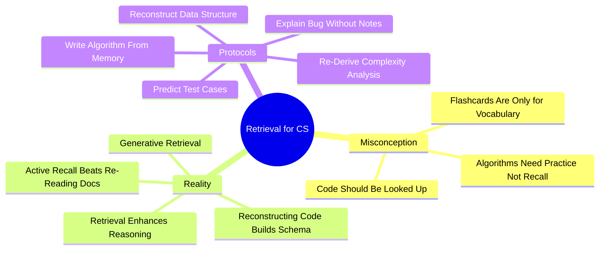

# 5.6 Retrieval Practice for Algorithmic Thinking

Many CS students believe "retrieval practice" (like flashcards) is only useful for simple vocabulary recall. This is a massive mistake. Retrieval practice — the act of forcing yourself to reconstruct programming concepts, algorithmic logic, and code structure from memory — directly enhances algorithmic thinking and computational problem-solving. This note explains the research and provides concrete protocols.

## The Core Principle

The naive model: *flashcards are for vocabulary; algorithms are learned by practice.*

The actual model: *retrieval practice is for everything, including algorithms. Active reconstruction of algorithmic logic builds stronger schemas than passive re-reading of documentation.*

The difference matters. Students who only practice (write code) without retrieval tend to plateau at the "can solve familiar problems" level. Students who combine practice with retrieval develop the ability to *reason about* novel problems — which is what technical interviews and real-world engineering demand.

## The Research

The paper *Retrieval Practices Enhance Computational and Scientific Thinking Skills* (Frontiers in Education, 2022) demonstrated that retrieval practice is deeply linked to inductive and deductive reasoning, not just rote recall.

### What They Found

- Students who engaged in retrieval practice (forcing themselves to reconstruct concepts from memory) outperformed students who only re-read or re-watched material.
- The benefit extended beyond simple recall: retrieval practice improved **computational thinking** — the ability to decompose problems, recognize patterns, and design algorithms.
- The effect was strongest for **generative retrieval** (reconstructing complex artifacts from scratch) rather than recognition-based retrieval (multiple choice).

### Why This Matters

The finding overturns the common belief that "you cannot memorize your way to becoming a programmer." That belief is true but misleading: you cannot memorize *vocabulary* your way to becoming a programmer, but retrieval practice is not just vocabulary memorization. It is the act of forcing your brain to reconstruct logical structures, which builds the neural pathways that constitute algorithmic thinking.

## The Mechanism

### Mechanism 1: Generative Retrieval Builds Schemas

When you re-read a sorting algorithm, you process the information passively. The schema is provided for you. When you must reconstruct the algorithm from memory, you are forced to actively generate the schema — to ask yourself "what comes first? what is the loop condition? what is the inductive step?" This active generation builds stronger, more transferable schemas.

### Mechanism 2: Retrieval Reveals Conceptual Gaps

You can read an algorithm and believe you understand it. You cannot reconstruct an algorithm you do not understand — the gaps are immediately visible. Retrieval is the diagnostic tool that exposes the illusion of comprehension.

### Mechanism 3: Reconstruction Strengthens Neural Pathways

Each act of retrieving an algorithm from memory strengthens the neural pathways that constitute that algorithm. The pathways become faster and more automatic, freeing working memory for higher-level reasoning. This is the cognitive substrate of "thinking like a programmer."

### Mechanism 4: Retrieval Practice Improves Transfer

Students who only practice familiar problems develop context-bound schemas. Students who engage in retrieval practice develop more abstract schemas that transfer to novel problems. Transfer is what matters in technical interviews and real-world engineering.

## The Protocols

### Protocol 1: Write Algorithm Signatures From Memory

For each algorithm you have studied (binary search, quicksort, BFS, Dijkstra, dynamic programming), write the function signature from memory:

- Function name
- Parameters (with types)
- Return type
- Time and space complexity

If you cannot recall the signature, you do not know the algorithm well enough. Re-study it.

### Protocol 2: Reconstruct Algorithm Implementations From Memory

For each algorithm, attempt to implement it from memory:

1. Close all references.
2. Open a blank document.
3. Write the full implementation.
4. Compare to a reference implementation.
5. Identify discrepancies. Re-study the parts you got wrong.

This is hard. You will fail frequently at first. The failures are the learning.

### Protocol 3: Re-Derive Complexity Analysis

For each algorithm:

1. Write the recurrence relation (if recursive).
2. Solve the recurrence (master theorem, substitution, recursion tree).
3. State the time and space complexity.
4. Compare to the reference.

This builds the skill of analyzing new algorithms, which is essential for technical interviews.

### Protocol 4: Reconstruct Data Structure Operations

For each data structure (hash table, binary search tree, heap, graph, trie):

1. State the operations it supports.
2. State the time complexity of each operation.
3. Implement one core operation from memory (e.g., heapify, hash function, BST insert).
4. State the trade-offs vs. alternative data structures.

### Protocol 5: Predict Test Cases

For any function (yours or someone else's):

1. List 5 test cases that should be run.
2. Predict the output for each.
3. Include edge cases (empty input, single element, maximum size, invalid input).
4. Run the tests. Compare to your predictions.

This builds the test-driven mindset, which is essential for production engineering.

### Protocol 6: Explain a Bug Without Notes

When you encounter a bug:

1. Without looking at any references, explain the bug aloud.
2. State your hypothesis for the cause.
3. State how you would test the hypothesis.
4. State the fix.
5. Only after the explanation, consult references to verify.

This forces you to engage your mental model rather than immediately searching Stack Overflow.

### Protocol 7: Re-Derive Algorithm Patterns

Algorithm patterns (sliding window, two pointers, fast and slow pointers, merge intervals, cyclic sort, etc.) are schemas that solve broad classes of problems. For each pattern:

1. State the problem structure that signals the pattern.
2. State the template for the pattern.
3. Implement the template from memory.
4. Solve a novel problem using the pattern.

### Protocol 8: Free Recall After Coding Practice

After completing a coding practice session:

1. Close all references.
2. Spend 5 minutes writing down everything you remember about the algorithms you used.
3. Include signatures, complexity, edge cases, and your mistakes.
4. Compare to your notes.

This is the same free-recall technique from [[2.2 Active Recall]], applied to CS.

## Common Pitfalls

### Pitfall 1: Treating Flashcards as Sufficient

Flashcards are good for vocabulary (syntax, time complexities, definitions). They are not sufficient for algorithmic thinking, which requires *generative* retrieval (reconstructing implementations from scratch).

### Pitfall 2: Re-Reading Documentation Instead of Retrieving

The default student behavior: when you forget how something works, look it up. The retrieval approach: when you forget, try to recall it first. Only look it up if retrieval fails. The act of attempting retrieval strengthens the memory, even if you fail.

### Pitfall 3: Avoiding Retrieval Because "I'll Just Look It Up"

The "I don't need to memorize; I'll just Google it" mindset. True for rarely-used facts. False for core algorithms and data structures, which form the substrate of all your reasoning. If you have to look up binary search every time, you cannot reason about problems that require binary search.

### Pitfall 4: Retrieving Without Verifying

Retrieval without verification is risky: you might retrieve incorrectly and reinforce a wrong memory. Always verify retrievals against a reference.

### Pitfall 5: Retrieving Only Easy Material

It is tempting to retrieve only the material you already know well. The benefit comes from retrieving material you *struggle* with. Focus your retrieval practice on your weak areas.

### Pitfall 6: Not Scheduling Retrieval Sessions

Retrieval practice must be scheduled, not opportunistic. Add retrieval sessions to your weekly plan: "Monday: reconstruct sorting algorithms. Wednesday: reconstruct graph algorithms. Friday: reconstruct dynamic programming patterns."

## Daily Application

Integrate retrieval into your CS study:

1. **Daily (10-15 min):** Reconstruct one algorithm or data structure operation from memory.
2. **After each coding session (5 min):** Free recall of what you learned.
3. **Weekly (1 hour):** Full retrieval session covering the week's algorithms.
4. **Before technical interviews:** Reconstruct the top 30 algorithms from memory over a week.
5. **Spaced repetition with Anki:** For vocabulary (syntax, time complexities), use Anki; see [[2.3 Spaced Repetition]].

## Cross-References

- The general retrieval principle is in [[2.2 Active Recall]].
- The scheduling protocol is in [[2.3 Spaced Repetition]].
- Tracing is the complementary skill; see [[5.2 Code Comprehension and Tracing]].
- Worked examples provide the source material; see [[5.3 Worked Examples and the Completion Method]].
- Daily integration is in [[6.3 Active Learning Sessions]].

#cs-education #retrieval #algorithmic-thinking #technique #science
