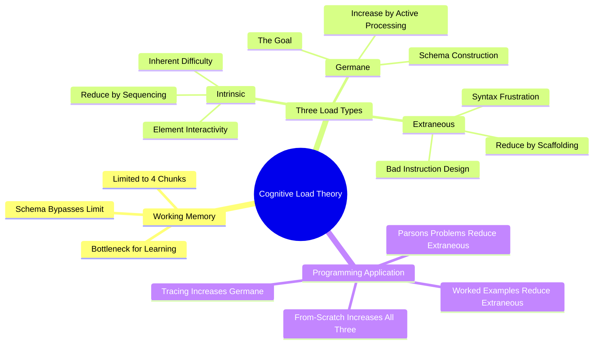

# 5.7 Cognitive Load Theory in Programming

Cognitive Load Theory (CLT), developed by John Sweller in 1988, is the framework that explains why programming is hard to learn and how to make it easier. CLT distinguishes three types of cognitive load — intrinsic, extraneous, and germane — and prescribes interventions for each. Understanding CLT is the key to designing programming instruction that actually builds schemas rather than overwhelming working memory. This note explains the theory and its application to programming.

## The Core Principle

The brain has a finite working memory capacity — roughly 4 chunks (Cowan, 2001), down from the older estimate of 7±2 (Miller, 1956). Working memory is the bottleneck for learning: all new information must pass through it to be encoded into long-term memory.

If working memory is overloaded, learning fails. The information does not get encoded; the schema does not get built; the next session starts from scratch. This is why "study harder" sometimes produces no improvement — the student is already at capacity; more effort just produces more overload.

Cognitive Load Theory distinguishes three types of load on working memory:

1. **Intrinsic load** — the inherent difficulty of the material.
2. **Extraneous load** — load imposed by poor instruction or task design.
3. **Germane load** — load devoted to schema construction.

The goal of instruction is to minimize extraneous load, manage intrinsic load, and maximize germane load.

## The Three Types of Load

### Type 1: Intrinsic Load

Intrinsic load is the inherent difficulty of the material, determined by **element interactivity** — the number of elements that must be processed simultaneously to understand the material.

- **Low element interactivity:** Learning vocabulary words. Each word can be learned independently. Intrinsic load is low.
- **High element interactivity:** Learning a sorting algorithm. You must simultaneously hold in working memory the loop structure, the comparison, the swap, the index manipulation, the termination condition. Intrinsic load is high.

Intrinsic load cannot be reduced without changing the material itself. But it can be **managed** by sequencing: break the material into smaller chunks, learn each chunk in isolation, then integrate. This is the **part-whole** approach.

#### Managing Intrinsic Load in Programming

For a complex algorithm:
1. Learn the problem statement alone.
2. Learn the high-level approach (without code).
3. Learn the algorithm step by step (without implementation details).
4. Learn the implementation piece by piece.
5. Integrate into the full implementation.

Each step has manageable intrinsic load. Jumping straight to step 5 overloads working memory.

### Type 2: Extraneous Load

Extraneous load is load imposed by *how* the material is presented, not by the material itself. It is wasteful — it consumes working memory without contributing to schema construction.

Common sources of extraneous load in programming:

- **Syntax errors** — missing semicolons, mismatched brackets, indentation errors. These force the learner to manage syntax instead of logic.
- **Distracting formatting** — code that is hard to read, poorly named variables, missing whitespace.
- **Split attention** — code on one page, explanation on another, requiring the learner to mentally integrate them.
- **Redundant information** — code that repeats the explanation in a different form, forcing the learner to reconcile them.
- **Poorly decomposed examples** — code that mixes multiple concepts, preventing the learner from isolating each.
- **From-scratch writing tasks for novices** — the act of producing syntax, designing logic, and debugging simultaneously is massive extraneous load.

Extraneous load can be **eliminated** through better instruction design:

- Use worked examples (see [[5.3 Worked Examples and the Completion Method]]) instead of from-scratch tasks.
- Use Parsons Problems (see [[5.4 Parsons Problems]]) to isolate logic from syntax.
- Provide syntactically correct code that the learner can study.
- Use clear formatting, meaningful names, and consistent style.
- Present code and explanation together (annotated code).
- Decompose examples into single-concept units.

### Type 3: Germane Load

Germane load is load devoted to schema construction. It is the "productive" load — the cognitive effort that produces learning.

Germane load is increased by:

- **Active processing** — elaboration, generation, explanation. See [[2.2 Active Recall]] and [[2.5 The Feynman Technique]].
- **Varied practice** — solving problems with different surface features but the same underlying structure.
- **Comparison** — comparing multiple examples of the same pattern.
- **Self-explanation** — explaining each step of a worked example to yourself.
- **Retrieval practice** — forcing yourself to reconstruct the material.

Germane load is the goal. Instruction should maximize germane load once extraneous load is minimized and intrinsic load is managed.

## How the Three Loads Interact

Total cognitive load = intrinsic + extraneous + germane. This total cannot exceed working memory capacity.

- If extraneous load is high, germane load must be low (because intrinsic is fixed). Learning fails.
- If extraneous load is minimized, germane load can be high. Learning succeeds.
- If intrinsic load is too high (material too complex), even with zero extraneous load, germane load is squeezed out. Learning fails. Solution: sequence the material to reduce intrinsic load.

The implication: **before adding germane load (active practice), you must eliminate extraneous load (poor instruction).** Asking a novice to "practice writing code from scratch" before they have studied worked examples is malpractice — it adds extraneous load (syntax frustration, debugging) before germane load can be effective.

## Application to Programming Instruction

### Stage 1: Worked Examples (High Intrinsic, Low Extraneous, Medium Germane)

The novice studies fully worked examples with annotations. Intrinsic load is high (the material is new), but extraneous load is low (no syntax production, no debugging). Germane load is medium (active tracing, self-explanation).

### Stage 2: Completion Problems (High Intrinsic, Low Extraneous, High Germane)

The novice completes partial examples. Intrinsic load is still high, extraneous load is low (most syntax provided), germane load is high (the learner must actively construct the missing parts).

### Stage 3: Parsons Problems (High Intrinsic, Low Extraneous, High Germane)

The learner rearranges scrambled code blocks. Intrinsic load is high, extraneous load is very low (no syntax production), germane load is very high (logic-focused reasoning).

### Stage 4: From-Scratch Writing (High Intrinsic, Medium Extraneous, High Germane)

The learner writes code from scratch. Intrinsic load is high, extraneous load is medium (syntax is now mostly automated), germane load is high (synthesis of patterns).

The progression is from low-extraneous to medium-extraneous as the learner's syntax fluency develops. Each stage prepares the learner for the next.

## Common Pitfalls

### Pitfall 1: From-Scratch Writing as the First Activity

The dominant failure mode in CS education. Novices are asked to write code from scratch before studying examples. This produces massive extraneous load, zero germane load, and no learning.

### Pitfall 2: Assuming More Practice = More Learning

Practice produces learning only when extraneous load is low enough that germane load can occur. Practice with high extraneous load (frustrating, syntax-heavy) produces little learning.

### Pitfall 3: Not Sequencing Material

Jumping from simple to complex without intermediate steps. Each step should add one new concept; jumping multiple concepts overloads intrinsic load.

### Pitfall 4: Ignoring Schema Construction

Treating programming as "memorizing syntax" or "practicing typing." Programming is schema construction. Instruction should be designed to maximize schema construction, not rote practice.

### Pitfall 5: Over-Scaffolding (Forever)

The opposite failure. Some learners stay in the worked-example stage forever and never progress to from-scratch writing. Scaffolding must fade as schemas develop.

## Cross-References

- Worked examples reduce extraneous load; see [[5.3 Worked Examples and the Completion Method]].
- Parsons Problems reduce extraneous load further; see [[5.4 Parsons Problems]].
- Tracing increases germane load; see [[5.2 Code Comprehension and Tracing]].
- Retrieval practice increases germane load; see [[5.6 Retrieval Practice for Algorithmic Thinking]].
- The general cognitive load principle underlies the six ingredients in [[1.4 The Six Critical Ingredients of Learning]] (especially attention and breaks).

#cs-education #cognitive-load #working-memory #theory #science
