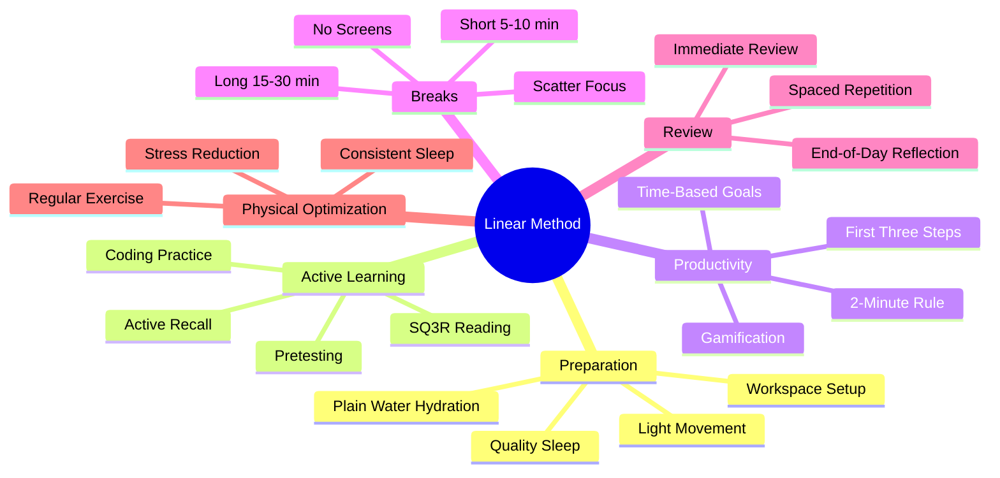

# 6.1 MOC - The Linear Method Implementation

The Linear Method is a daily operating system that integrates every technique in this vault into a coherent routine. It is organized as a sequence of phases: **Preparation → Active Learning → Productivity → Breaks → Review → Physical Optimization.** Each phase has specific protocols, and skipping any phase breaks the chain.

The original Linear Method (from the source material) contained a mix of valid science and pop-neuroscience rituals. This implementation keeps only the valid science. All biohacking elements (cold showers for dopamine, salt-water hydration, 40 Hz therapy, intermittent fasting for BDNF) have been stripped out. See [[7.2 Biohacking Myths]] for the reasons.

## Mermaid Mind Map - Chapter 6

## Notes in This Chapter

- [[6.2 Preparation - Mind and Environment]] — The morning protocol: sleep, hydration, light movement, workspace setup.
- [[6.3 Active Learning Sessions]] — How to structure a single study session: pretest → read → recall → apply.
- [[6.4 Productivity and Task Management]] — Task breakdown, time-based goals, the 2-minute rule.
- [[6.5 Breaks and Recovery]] — Short and long break protocols; protecting consolidation.
- [[6.6 Review and Reinforcement System]] — Immediate review, spaced repetition scheduling, end-of-day reflection.
- [[6.7 Physical and Mental Optimization]] — Exercise, sleep, stress management (no biohacking).

## A Sample Day Using the Linear Method

Here is what a typical implementation looks like:

| Time | Phase | Activity |
|------|-------|----------|
| 06:30–07:00 | Preparation | Wake after 7-9 hours of sleep; drink a glass of plain water; 10 min light stretching. |
| 07:00–07:30 | Preparation | Eat a balanced breakfast; set up workspace; phone in another room. |
| 07:30–08:00 | Active Learning | **Pretest** on today's topic (5-10 practice problems, get them wrong). |
| 08:00–09:30 | Active Learning | Read using SQ3R; stop every 10 minutes and recite from memory. |
| 09:30–09:45 | Break | Walk, no screens, water. |
| 09:45–11:15 | Active Learning | Apply concepts through coding problems or worked-example completion. |
| 11:15–11:45 | Break | Walk outside, low stimulation. |
| 11:45–12:30 | Review | Immediate review: try to recall everything from the morning. |
| 12:30–13:30 | Lunch | Real food; away from screens. |
| 13:30–15:00 | Active Learning | Generative retrieval: reconstruct algorithms from memory. |
| 15:00–15:20 | Break | Stretch, water. |
| 15:20–16:30 | Productivity | Tackle next 3 small tasks; 2-minute rule for quick wins. |
| 16:30–17:00 | Review | Update Anki with new cards from today's learning. |
| 17:00–18:00 | Physical | Exercise (run, lift, walk, HIIT). |
| 18:00–19:00 | Dinner | — |
| 19:00–20:30 | Review | End-of-day reflection: explain today's concepts aloud. |
| 20:30–22:00 | Wind Down | No screens; reading; sleep preparation. |
| 22:00–06:30 | Sleep | 8 hours; the brain consolidates the day's learning. |

This schedule is illustrative, not prescriptive. Adapt the time blocks to your life. The *structure* (preparation → active learning → productivity → breaks → review → physical) is what matters.

## Cross-References

- Every phase of the Linear Method draws from earlier chapters. [[6.2 Preparation - Mind and Environment]] depends on [[3.2 Sleep and Memory Consolidation]] and [[4.3 Designing a Distraction-Free Workspace]].
- The active learning session structure in [[6.3 Active Learning Sessions]] implements [[2.2 Active Recall]], [[2.3 Spaced Repetition]], and (if you study CS) [[5.2 Code Comprehension and Tracing]].
- The review system in [[6.6 Review and Reinforcement System]] depends on [[2.3 Spaced Repetition]] and the Anki workflow in [[8.2 Spaced Repetition Software]].

#moc #linear-method #implementation #daily-routine
