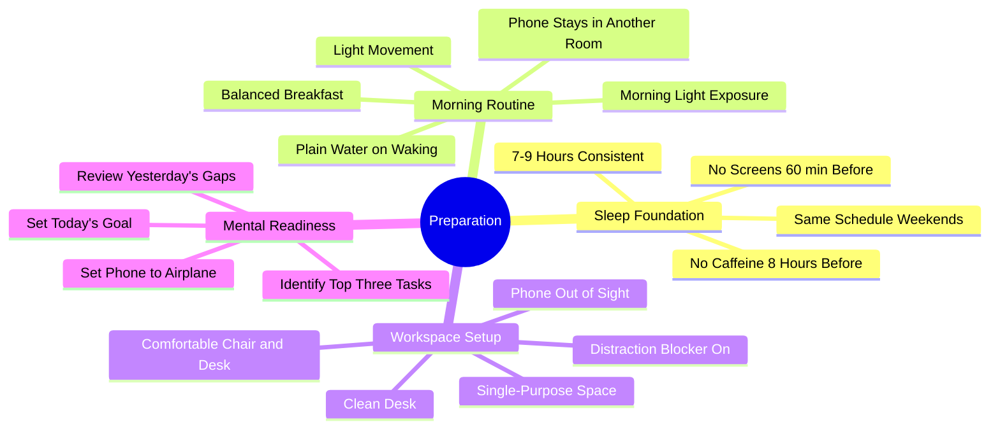

# 6.2 Preparation - Mind and Environment

The Preparation phase of the Linear Method is what happens *before* you sit down to study. It includes both the morning routine (sleep, hydration, movement) and the workspace setup. Good preparation makes the actual study time 2-3x more productive; poor preparation sabotages even the best techniques. This note details the evidence-based preparation protocol — with all biohacking elements removed.

## The Core Principle

Preparation has two components:

1. **Physiological preparation** — sleep, hydration, nutrition, movement. These determine the biological capacity of your brain to learn.
2. **Environmental preparation** — workspace setup, distraction management, tooling. These determine whether the biological capacity will be deployed on learning or on fighting distractions.

The original Linear Method (from the source material) mixed valid preparation elements with biohacking rituals: salt-lemon water, cold showers for dopamine, 40 Hz therapy, intermittent fasting for BDNF. These rituals are bad, terrible, and unsupported by evidence — see [[7.2 Biohacking Myths]]. This implementation keeps only the evidence-based elements.

## Phase 1: Sleep Foundation (The Night Before)

Preparation begins the night before. Without 7-9 hours of quality sleep, the rest of the protocol produces marginal gains on a degraded baseline.

### Sleep Protocol

1. **Sleep 7-9 hours, consistently.** Same sleep and wake times every day, including weekends.
2. **No screens 60 minutes before bed.** Blue light suppresses melatonin. If you must use a screen, use a blue-light filter (but the filter is partial — content stimulation also matters).
3. **No caffeine within 8 hours of bedtime.** Caffeine's half-life is 5-6 hours.
4. **No alcohol within 3 hours of bedtime.** Alcohol disrupts sleep architecture (suppresses REM).
5. **Cool, dark, quiet room.** 18-20°C, blackout curtains or sleep mask, earplugs or white noise.
6. **Consistent bedtime routine.** 30-60 minutes of low-stimulation activity (reading, stretching, journaling).

See [[3.2 Sleep and Memory Consolidation]] for the full sleep protocol and the mechanisms behind it.

## Phase 2: Morning Routine

### Step 1: Wake at a Consistent Time

Wake at the same time every day, including weekends. The body's circadian rhythm adapts to consistent cues; inconsistency produces "social jetlag" that impairs cognitive function.

Use an alarm if needed, but aim to wake naturally (without an alarm) once your rhythm is set. Waking naturally indicates that your body has had enough sleep.

### Step 2: Drink a Glass of Plain Water

After 7-9 hours without fluids, your body is mildly dehydrated. Drink a glass (250-500ml) of plain water on waking.

**Do not add salt or lemon.** The "salt-lemon water" ritual is biohacking nonsense. Your body maintains electrolyte balance through the renin-angiotensin-aldosterone system (RAAS) and vasopressin; in a healthy, well-nourished person, adding trace sodium to morning water provides no cognitive benefit and may slightly increase cardiovascular risk. Plain water is sufficient. See [[7.2 Biohacking Myths]] for the debunking.

### Step 3: Get Morning Light Exposure

Step outside for 10-15 minutes within an hour of waking. Natural morning light:
- Suppresses residual melatonin.
- Triggers cortisol release (the natural morning cortisol spike).
- Sets the circadian rhythm for the day (which determines that evening's melatonin release).

If natural light is not available (winter, early shift), use a 10,000 lux light therapy lamp for 10-15 minutes.

### Step 4: Light Movement

Engage in 10-20 minutes of light cardiovascular activity: walking, jogging, stretching, yoga, or calisthenics. This:
- Increases blood flow to the brain.
- Triggers BDNF release (supporting neuroplasticity).
- Raises core body temperature (which supports alertness).
- Provides a scatter-focus window (see [[3.5 Embracing Boredom and Scatter Focus]]).

Avoid high-intensity exercise first thing in the morning if it leaves you fatigued for the rest of the day. Save HIIT for later.

**Do not take a cold shower for "dopamine."** Cold showers do produce acute arousal via adrenaline release, but the arousal is short-lived (30-60 minutes) and the dopamine claims are overstated. A 10-minute walk produces more sustained alertness. See [[7.2 Biohacking Myths]] for the debunking.

### Step 5: Balanced Breakfast

Eat a balanced breakfast that includes:
- Complex carbohydrates (oats, whole-grain toast, fruit) for sustained glucose.
- Protein (eggs, yogurt, nuts) for satiety and amino acids.
- Healthy fats (avocado, nuts, olive oil) for sustained energy.

Avoid:
- **Sugary breakfasts** — produce an insulin spike followed by reactive hypoglycemia ("brain fog" 90 minutes later).
- **Skipping breakfast for "fasting BDNF"** — the cognitive benefits of short-term fasting are overstated, and skipping breakfast can impair working memory in tasks requiring high executive function. See [[7.2 Biohacking Myths]].

### Step 6: Moderate Caffeine (Optional)

If you use caffeine:
- Wait 90 minutes after waking. This allows natural cortisol to peak first (caffeine disrupts the natural morning cortisol rhythm if taken too early).
- Limit to 100-200mg in the morning (1-2 cups of coffee).
- No caffeine within 8 hours of bedtime.
- Consider tea (L-theanine + caffeine) for smoother alertness without jitters.

## Phase 3: Workspace Setup

### Step 1: Use a Single-Purpose Space

Study only in your study space. Do not eat, watch TV, or socialize there. See [[4.3 Designing a Distraction-Free Workspace]].

### Step 2: Clean the Desk

Remove everything not needed for today's study. A clean desk removes visual distractions.

### Step 3: Phone in Another Room

Not on the desk. Not face-down. Not on silent. **In another room.** The phone's mere presence degrades working memory (Ward et al., 2017).

If you need the phone for time-sensitive communication, use a smartwatch with notifications limited to phone calls and texts from specific people. Or check the phone only during scheduled breaks.

### Step 4: Distraction Blocker On

Configure and activate distraction-blocking software (Freedom, Cold Turkey, Forest) before starting. Configuring it mid-session is itself a distraction.

See [[8.4 Focus and Distraction-Blocking Tools]] for recommendations.

### Step 5: Auditory Environment

- Quiet if possible.
- Pink noise or brown noise if the environment is noisy.
- Noise-cancelling headphones if needed.
- No music with lyrics. No podcast. No background TV.

### Step 6: Comfortable Setup

- Chair at correct height (forearms parallel to floor).
- Monitor at eye level.
- Feet flat on floor or on a footrest.
- Adequate lighting (natural if possible; full-spectrum if not).
- Cool temperature (18-22°C).

## Phase 4: Mental Readiness

### Step 1: Set Today's Goal

Before opening any material, write down today's specific goal:
- Bad: "Study algorithms."
- Good: "Master Dijkstra's algorithm. Be able to implement from memory. Solve 3 practice problems."

A specific goal directs attention and provides a stopping criterion.

### Step 2: Identify the Top Three Tasks

List the top three tasks for the day. Not five, not ten — three. If you complete them, you have had a successful day. If you do not complete them, you have a clear carry-over for tomorrow.

### Step 3: Review Yesterday's Gaps

Spend 2 minutes reviewing yesterday's notes. Identify any gaps or confusions. Add them to today's agenda.

### Step 4: Phone to Airplane Mode

If your phone must be in the room (e.g., for time-sensitive communication), put it in airplane mode. Activate it only during scheduled breaks.

## The Original Linear Method: What to Keep, What to Drop

| Original Element | Keep? | Reason |
|------------------|-------|--------|
| 7-9 hours sleep | Keep | Validated by sleep science |
| Wake at sunrise (consistent time) | Keep | Circadian rhythm support |
| Plain water on waking | Keep | Rehydration |
| Salt + lemon in water | DROP | Biohacking myth; plain water is sufficient |
| Cold shower for dopamine | DROP | Biohacking myth; light exercise is better |
| Light cardio | Keep | Increases blood flow, BDNF |
| Intermittent fasting for BDNF | DROP | Myth; eat a balanced breakfast |
| Meditation / prayer | Keep (optional) | Useful for focus if practiced |
| Balanced breakfast | Keep | Sustained glucose |
| Moderate caffeine | Keep (optional) | Alertness |
| 40 Hz sound/light therapy | DROP | Myth; no evidence for healthy adults |
| Dedicated workspace | Keep | Critical for focus |
| Noise-cancelling headphones | Keep | Useful for noisy environments |
| Distraction-blocking apps | Keep | Effective |
| Limit phone usage | Keep | Critical |

## Common Pitfalls

### Pitfall 1: Skipping Sleep to "Prepare More"

The most common failure. Sacrificing sleep to do more morning preparation is self-defeating. Sleep IS the most important preparation.

### Pitfall 2: Adding Biohacking Rituals

Salt water, cold showers, 40 Hz therapy, fasting for BDNF. These rituals feel productive but produce no measurable learning benefit. They are procrastination disguised as optimization. Drop them.

### Pitfall 3: Inconsistent Mornings

Waking at 6 AM on weekdays and 10 AM on weekends. The body's circadian rhythm cannot adapt to a 4-hour swing. Consistency matters more than the specific wake time.

### Pitfall 4: Workspace Setup Drift

Letting the desk accumulate clutter over the week. Letting distractions creep back in. Audit the workspace weekly.

### Pitfall 5: Skipping Mental Readiness

Jumping straight into study without setting today's goal. Results in unfocused, scattered work.

## Cross-References

- Sleep protocol is detailed in [[3.2 Sleep and Memory Consolidation]].
- Workspace design is in [[4.3 Designing a Distraction-Free Workspace]].
- The distraction problem is in [[4.2 The Cost of Overstimulation]].
- The myth debunkings are in [[7.2 Biohacking Myths]].
- The full daily schedule is in [[6.1 MOC - The Linear Method]].

#linear-method #preparation #morning-routine #environment #technique
