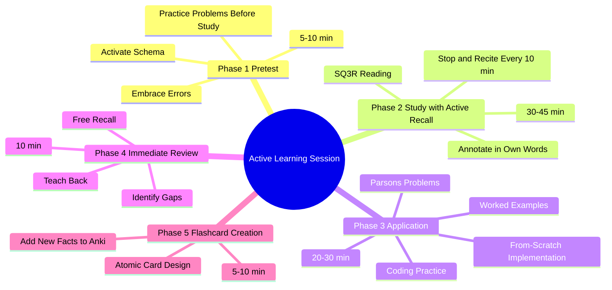

# 6.3 Active Learning Sessions

The Active Learning Session is the core unit of the Linear Method. It is a structured 60-120 minute block that integrates pretesting, reading (with active recall), application, and review. This note explains the session structure and how to execute it.

## The Core Principle

The naive study session: *open the textbook → read for an hour → close the textbook → feel like you studied.*

The actual study session: *pretest → study actively with retrieval checkpoints → apply the material → free recall → create flashcards → teach back.*

The structured session produces 3-5x more learning per unit time than the naive session, because it activates all six ingredients (see [[1.4 The Six Critical Ingredients of Learning]]) and every stage of the memory pipeline (encoding, consolidation, retrieval — see [[1.2 The Science of Memory]]).

## The Session Structure

A standard 90-minute session:

| Phase | Duration | Activity |
|-------|----------|----------|
| 1. Pretest | 5-10 min | Attempt practice problems before studying. |
| 2. Active Study | 30-45 min | Read or watch with SQ3R + Stop and Recite. |
| 3. Application | 20-30 min | Apply through coding practice or problem-solving. |
| 4. Immediate Review | 10 min | Free recall + identify gaps + teach back. |
| 5. Flashcard Creation | 5-10 min | Add new facts to Anki. |

Adapt the durations to your material and energy. The structure matters more than the exact timings.

## Phase 1: Pretest (5-10 minutes)

### What to Do

Find or create 5-10 practice problems on today's topic. Attempt them all, even if you have not studied the material. Note your confidence level for each answer (high/medium/low).

### Why

The pretest activates the hypercorrection effect: high-confidence errors produce the strongest subsequent learning. The pretest also primes your attention to notice the relevant information during the study phase. See [[2.4 Pretesting and Hypercorrection]].

### How to Find Practice Problems

- End-of-chapter problems in your textbook.
- Online judge platforms (LeetCode, Exercism, Codewars) for CS topics.
- Past exam papers.
- Self-generated questions from previous sessions.

### Common Mistakes

- **Skipping the pretest because "I don't know anything."** The point is to be wrong. The errors are the learning.
- **Not committing to an answer.** If you say "I don't know" without guessing, you lose the hypercorrection benefit.
- **Spending too long.** 5-10 minutes. If you do not know, guess and move on.

## Phase 2: Active Study (30-45 minutes)

### What to Do

Study the material using the SQ3R method ([[2.8 SQ3R Method]]):
1. **Survey** the structure (headings, diagrams, summaries).
2. **Question** — convert each heading to a question.
3. **Read** actively, hunting for answers to your questions.
4. **Recite** — pause every 10 minutes and use Stop and Recite ([[2.9 Stop and Recite]]).
5. **Review** — at the end, summarize from memory.

### Why

Active study with retrieval checkpoints (Stop and Recite) interrupts the fluency illusion. You cannot read passively and believe you understand; the recitation forces you to test your understanding continuously.

### How to Annotate

Take notes in your own words (not copying the textbook). Use:
- Markdown files in your Obsidian vault.
- Brief annotations, not full transcripts.
- Questions you cannot answer (for follow-up).
- Connections to other concepts (using [[wiki links]]).

### Common Mistakes

- **Transcribing rather than annotating.** If you copy the textbook verbatim, you are not processing.
- **Skipping Stop and Recite.** The single most common failure. The technique feels like wasted time but is the source of the learning.
- **Reading for too long without a break.** Vigilance decrement hits at 20-40 minutes. Use the Pomodoro structure ([[2.6 The Pomodoro Technique]]) if needed.

## Phase 3: Application (20-30 minutes)

### What to Do

Apply the material through concrete practice:

- **For CS topics:** Solve coding problems, complete worked examples, solve Parsons Problems, implement from scratch. See [[5.1 MOC - CS Education]].
- **For mathematics:** Solve problems from the textbook, re-derive theorems from memory, work through proofs.
- **For languages:** Write sentences, conjugate verbs, translate passages.
- **For conceptual subjects:** Explain the material using the Feynman Technique ([[2.5 The Feynman Technique]]), draw concept maps, answer application questions.

### Why

Application is where the schema is built. Reading gives you the pattern; application forces you to use the pattern, which strengthens the schema and exposes gaps.

### The Application Progression (For CS)

For a new CS concept, use this progression:

1. **Worked example study** (5-10 min) — Trace a fully worked example. ([[5.3 Worked Examples and the Completion Method]])
2. **Modification** (5 min) — Modify the example. Predict and verify.
3. **Parsons Problem** (5-10 min) — Solve a Parsons Problem for the same pattern. ([[5.4 Parsons Problems]])
4. **Completion problem** (10 min) — Complete a partial implementation.
5. **From-scratch implementation** (10-15 min) — Implement a similar problem from scratch. ([[5.6 Retrieval Practice for Algorithmic Thinking]])

### Common Mistakes

- **Skipping to from-scratch writing.** The most common failure. Without the preceding steps, from-scratch writing produces cognitive overload and trial-and-error programming.
- **Not predicting before running.** Always predict the output before running code.
- **Avoiding hard problems.** The application phase should include problems that stretch your ability. Easy problems produce little learning.

## Phase 4: Immediate Review (10 minutes)

### What to Do

1. **Free recall** (5 min): Close everything. Write down everything you remember from the session. Don't peek. Don't structure. Just dump.
2. **Identify gaps** (2 min): Compare your free recall to the material. Mark what you missed.
3. **Teach back** (3 min): Explain the day's main concept aloud, in plain language, using the Feynman Technique ([[2.5 The Feynman Technique]]).

### Why

The immediate review exploits the testing effect at the moment the trace is most fragile. Free recall strengthens the trace; gap identification reveals what to re-study; teach back exposes conceptual confusion.

### Common Mistakes

- **Skipping the review because "I'll review later."** The review is the learning. Later review is consolidation, not learning.
- **Not doing the teach back.** Free recall is good; teach back is better. The synthesis required by teach back exposes gaps that free recall misses.
- **Reviewing with the book open.** That is re-reading, not recall.

## Phase 5: Flashcard Creation (5-10 minutes)

### What to Do

For each discrete fact you want to retain long-term:
- Create an atomic flashcard in Anki or REMNote.
- One fact per card.
- Use application questions where possible, not just definitions.

See [[2.3 Spaced Repetition]] for card design principles and [[8.2 Spaced Repetition Software]] for tooling.

### Why

The session's learning will decay without spaced review. Flashcards convert the session's content into a long-term retention system.

### Common Mistakes

- **Creating too many cards.** 5-10 high-quality cards per session is enough. More becomes a burden.
- **Creating cards for concepts you do not understand.** Understand first, then make cards.
- **Creating cards with paragraphs on the back.** Atomic cards only. One fact per card.

## The Importance of Breaks Between Sessions

After a 90-minute session, take a 15-30 minute break. The break is when consolidation begins. See [[3.4 Strategic Breaks]] and [[3.3 Retrograde Interference]].

Critical break rules:
- No screens, no phone.
- Walk, stretch, do housework.
- Do not study a similar topic during the break (interference).

## Adapting the Session to Different Tasks

### For Learning a New Algorithm

- Phase 1 (Pretest): Attempt 2-3 problems that use the algorithm.
- Phase 2 (Study): Read the algorithm description and worked example. Trace.
- Phase 3 (Application): Implement the algorithm. Parsons Problem. From-scratch.
- Phase 4 (Review): Free recall the algorithm signature, complexity, and steps.
- Phase 5 (Flashcards): Add cards for time/space complexity and core invariants.

### For Reading a Research Paper

- Phase 1 (Pretest): Generate 3-5 questions from the title and abstract.
- Phase 2 (Study): Read with SQ3R. Stop and recite after each section.
- Phase 3 (Application): Summarize the paper's contribution in 3 sentences. Identify the key insight.
- Phase 4 (Review): Free recall the paper's main argument.
- Phase 5 (Flashcards): Add cards for key terms, related work, and limitations.

### For Practicing Coding Interview Problems

- Phase 1 (Pretest): Attempt the problem cold for 5 minutes.
- Phase 2 (Study): Read the problem carefully. Identify the pattern. Recall similar solved problems.
- Phase 3 (Application): Implement the solution. Test with edge cases. Optimize.
- Phase 4 (Review): Free recall the solution approach and complexity. Identify what made it hard.
- Phase 5 (Flashcards): Add cards for the pattern recognition cues and the algorithm template.

## Common Pitfalls

### Pitfall 1: Skipping Phases

The most common failure. Students skip the pretest ("I don't know anything yet"), skip Stop and Recite ("I'll review at the end"), skip the free recall ("I'll do it later"), skip the flashcards ("I'll make them later"). Each skipped phase reduces the session's effectiveness by ~20%.

### Pitfall 2: Allowing the Session to Drift

Without structure, 90 minutes becomes 30 minutes of study + 60 minutes of distraction. The structure is the discipline.

### Pitfall 3: Phone on the Desk

The phone's mere presence degrades working memory. Phone in another room for the entire session.

### Pitfall 4: Multi-Tasking

Studying while checking Slack. Studying while watching a video. Single-task. The brain cannot multitask; it can only switch with residue costs.

### Pitfall 5: No Break Between Sessions

Back-to-back sessions without breaks produce vigilance decrement and prevent consolidation. Always take a real break (see [[3.4 Strategic Breaks]]) between sessions.

## Cross-References

- Pretest: [[2.4 Pretesting and Hypercorrection]]
- SQ3R: [[2.8 SQ3R Method]]
- Stop and Recite: [[2.9 Stop and Recite]]
- Feynman Technique: [[2.5 The Feynman Technique]]
- Spaced Repetition: [[2.3 Spaced Repetition]]
- CS-specific application: [[5.1 MOC - CS Education]]
- Break design: [[3.4 Strategic Breaks]]
- Daily schedule: [[6.1 MOC - The Linear Method]]

#linear-method #study-sessions #active-learning #technique
