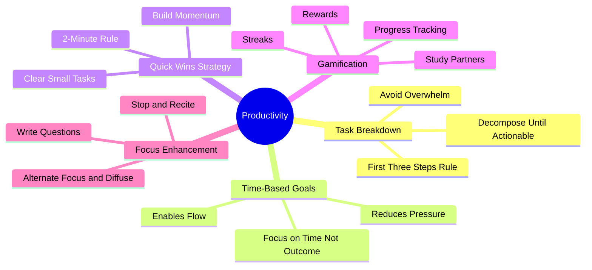

# 6.4 Productivity and Task Management

Productivity is not about doing more things. It is about doing the *right* things, in the right order, with minimal friction. This note covers the task management protocols of the Linear Method: the "first three steps" rule, time-based goals, the 2-minute rule, and gamification.

## The Core Principle

The naive productivity model: *make a to-do list → work through it → feel bad about what you didn't finish.*

The actual productivity model: *decompose tasks until they are actionable → focus on the next 3 steps → use time-based goals to reduce anxiety → build momentum with quick wins → track progress visually.*

The structured model produces more output with less stress, because it removes the cognitive overhead of deciding what to do next and the emotional overhead of an unbounded task list.

## Strategy 1: The First Three Steps Rule

### What to Do

When facing a large or intimidating task, identify only the **first three concrete steps**. Do not plan beyond them. Execute them. Then identify the next three.

### Why

Large tasks ("write the thesis," "build the app," "learn machine learning") are cognitively paralyzing. The brain cannot hold the full decomposition in working memory, so it produces anxiety instead of action.

By focusing on just the first three steps, you:
- Reduce the cognitive load to a manageable level.
- Provide a clear, immediate next action.
- Eliminate decision paralysis.
- Build momentum (the first three steps are easier than you feared).

### Example

Bad: "Build a web app."
- Step 1: Choose a framework.
- Step 2: Set up the project.
- Step 3: Build the first endpoint.

After completing these, identify the next three:
- Step 4: Design the data model.
- Step 5: Implement the database connection.
- Step 6: Build the CRUD endpoints.

Each set of three is approachable. The full task is not.

### Common Mistakes

- **Trying to plan the entire task before starting.** This produces analysis paralysis. Plan only the first three.
- **Choosing three steps that are too large.** Each step should take 15-60 minutes. If it takes longer, decompose further.
- **Skipping the rule for "easy" tasks.** Use the rule for any task that triggers procrastination.

## Strategy 2: Time-Based Goals

### What to Do

Set goals in terms of *time spent*, not *outcomes achieved*.

- Bad: "Finish chapter 4 today."
- Good: "Study chapter 4 for 90 minutes today."

### Why

Outcome-based goals create several problems:

1. **Variable scope anxiety.** "Finish chapter 4" might take 1 hour or 5 hours depending on difficulty. You cannot predict, which creates anxiety.
2. **Failure feedback.** If you do not finish, you feel you failed, even if you studied effectively.
3. **Sacrifice of depth for completion.** To "finish," you may skim material you should have studied deeply.

Time-based goals solve all three:

1. **Predictable.** You know exactly how long you will study.
2. **Always achievable.** You "succeed" by showing up, not by completing arbitrary scope.
3. **Encourage depth.** You can study deeply without worrying about "falling behind."

### How to Implement

- Set a daily time goal: "3 hours of focused study today."
- Set a weekly time goal: "15 hours of focused study this week."
- Track the time actually spent (use a timer or app like Toggl).
- Do not extend the time goal to "finish" — if you run out of time, pick up tomorrow.

### Common Mistakes

- **Counting low-focus time as study time.** Time spent with the phone on the desk, half-watching YouTube, is not study time. Only count focused time.
- **Setting unrealistic time goals.** "8 hours of focused study" is not achievable for most people. Start with 2-3 hours and build up.
- **Not tracking time.** Without tracking, you will overestimate how much you studied (planning fallacy).

## Strategy 3: The 2-Minute Rule

### What to Do

If a task takes less than 2 minutes, do it immediately. Do not add it to your to-do list.

### Why

Small tasks (replying to a quick email, putting a dish in the dishwasher, paying a small bill) have disproportionate cognitive overhead relative to their actual time cost. Adding them to a to-do list means you will:
- Spend time deciding when to do them.
- Spend time remembering to do them.
- Spend time feeling guilty for not doing them.

All of this overhead exceeds the 2 minutes it would take to just do the task.

### How to Implement

For each task that arises, ask: "Can I do this in under 2 minutes?" If yes, do it now. If no, add it to your to-do list with a realistic time estimate.

### Common Mistakes

- **Abusing the rule.** "I'll just check social media for 2 minutes" is not a task. The 2-minute rule is for *tasks*, not for *distractions*.
- **Doing small tasks during focus blocks.** The 2-minute rule applies during administrative time, not during focus sessions. If a 2-minute task arises during a focus session, write it down and do it during the next break.

## Strategy 4: Build Momentum with Easy Tasks

### What to Do

When you are stuck or low-energy, start with the easiest task on your list. Complete it. Use the resulting sense of accomplishment to tackle the next, slightly harder task.

### Why

Action produces motivation, not the other way around. Most people wait for motivation before acting, but motivation often does not come. Starting with an easy task breaks the inertia:

1. The easy task provides a quick win.
2. The quick win triggers dopamine release.
3. The dopamine makes the next task easier to start.
4. The momentum builds.

This is especially useful for ADHD or low-energy days. See also the ADHD productivity research summarized in the source material.

### How to Implement

- Order your daily task list by difficulty (easiest first) on low-energy days.
- On high-energy days, order by importance (most important first).
- Be willing to switch orders mid-day based on energy.

### Common Mistakes

- **Only doing easy tasks.** The easy tasks are momentum builders, not the day's work. After the easy tasks, tackle the hard one.
- **Feeling guilty for "only" doing easy tasks.** On a low-energy day, doing any task is a win. Momentum will build.

## Strategy 5: Gamification and Progress Tracking

### What to Do

Turn studying into a game:

1. **Track streaks** — consecutive days of meeting your study time goal.
2. **Track progress visually** — a chart, calendar, or app that shows your accumulated study time.
3. **Set rewards** — small rewards for daily goals, larger rewards for weekly goals.
4. **Consider studying with friends** — friendly competition boosts motivation.

### Why

Gamification exploits the brain's reward system to make consistent study feel rewarding in the short term. Without gamification, the rewards of study are delayed (weeks or months until the exam, the interview, the project ship). The delay makes it hard to sustain motivation.

With gamification, you get immediate rewards (a streak number goes up, a chart fills in, a reward is unlocked). These immediate rewards bridge the gap to the long-term rewards.

### How to Implement

- **Streak tracking:** Use a habit tracker app (Streaks, Habitica, Loop Habit Tracker) or a simple paper calendar with X marks.
- **Progress visualization:** Use a chart in your journal, a Toggl report, or a dedicated app.
- **Rewards:** Daily: a favorite tea, a walk outside. Weekly: a movie, a meal out, a purchase.
- **Study partners:** Find a friend who is also studying. Compare weekly hours. Discuss material weekly.

### Common Mistakes

- **Over-gamifying.** If the gamification system is too complex, maintaining it becomes a task in itself. Keep it simple.
- **Rewarding yourself for non-study.** The reward should be contingent on meeting the study goal, not just on showing up.
- **Breaking the streak and quitting.** Streaks will break (illness, travel, life). The rule is: never miss twice. One missed day is a blip; two missed days is a new pattern.

## Strategy 6: Focus Enhancement Within the Session

### What to Do

During focus sessions, use these micro-techniques:

1. **Alternate focus and diffuse.** Use the Pomodoro rhythm or flexible focus blocks (see [[4.4 Flexible Focus vs Rigid Blocks]]).
2. **Stop and recite.** Every 10 minutes, pause and recite key points (see [[2.9 Stop and Recite]]).
3. **Write questions during lectures.** Instead of taking verbatim notes, write questions. Review the questions after the lecture and try to answer them.

### Why

These micro-techniques maintain attention and produce active retrieval within the session. Without them, attention drifts and the session becomes passive.

### Common Mistakes

- **Treating these as optional extras.** They are the techniques that make the session productive. Skipping them reduces the session to passive reading.
- **Not writing the questions down.** Mental questions are forgotten. Written questions can be answered later.

## The Daily Productivity Protocol

A sample daily productivity flow:

1. **Evening before:** Identify tomorrow's top 3 tasks. Decompose each into first 3 steps.
2. **Morning:** Review the top 3. Set today's time goal (e.g., 4 hours of focused study).
3. **First focus block:** Tackle the most important task (if high energy) or the easiest task (if low energy).
4. **Break:** Take a real, low-stimulation break.
5. **Second focus block:** Continue with the next task.
6. **Mid-day review:** How much time have you studied? Adjust afternoon plan accordingly.
7. **Third focus block:** Final task or continuation.
8. **End of day:** Update habit tracker. Note what worked and what didn't. Plan tomorrow.

## Common Pitfalls

### Pitfall 1: Over-Planning

Spending 2 hours planning the day and 0 hours executing. Limit planning to 10-15 minutes.

### Pitfall 2: Multi-Tasking During Focus Blocks

Trying to do 3 tasks at once. Single-task. The brain cannot multitask.

### Pitfall 3: Allowing "Urgent" Tasks to Displace Important Tasks

Responding to every email, Slack, and notification during focus blocks. Urgent tasks can wait until the next break.

### Pitfall 4: Not Taking Real Breaks

"Breaks" spent on the phone. Real breaks are low-stimulation. See [[3.4 Strategic Breaks]].

### Pitfall 5: Beating Yourself Up for Bad Days

Some days will be unproductive. That is normal. The rule is "never miss twice" — one bad day does not break the system; two in a row does. Reset and continue.

## Cross-References

- The Pomodoro Technique is detailed in [[2.6 The Pomodoro Technique]].
- Flexible focus is in [[4.4 Flexible Focus vs Rigid Blocks]].
- Break design is in [[3.4 Strategic Breaks]].
- Distraction blocking tools are in [[8.4 Focus and Distraction-Blocking Tools]].
- Daily schedule integration is in [[6.1 MOC - The Linear Method]].

#linear-method #productivity #task-management #technique
