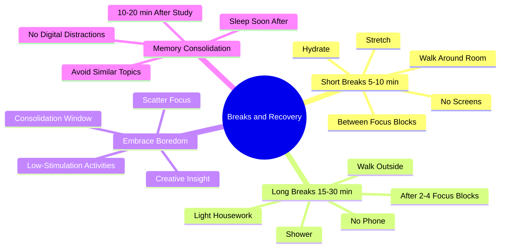

# 6.5 Breaks and Recovery

The Breaks and Recovery phase of the Linear Method is not optional downtime. It is the structured window during which memory consolidation happens, attention recovers, and creative integration occurs. This note details the break protocols integrated into the daily schedule.

## The Core Principle

The naive model: *study → take a break by scrolling social media → study more → feel exhausted → sleep poorly → repeat.*

The actual model: *study → take a low-stimulation break to consolidate → study more → take a longer low-stimulation break → sleep well → consolidate overnight.*

The structured break protocol produces 2-3x more learning per unit study time, because consolidation (not study) is the bottleneck. Without proper breaks, the study time produces fragile traces that decay before they consolidate.

## The Three Break Lengths

### Short Break (5-10 minutes)

**When:** Between focus blocks (every 25-50 minutes).

**What to do:**
- Stand up. Move your body.
- Walk around the room.
- Stretch your arms, neck, and back.
- Drink water.
- Look out a window (eye relief from screens).
- Take 5-10 deep breaths.

**What NOT to do:**
- Check your phone.
- Check email or Slack.
- Scroll social media.
- Watch YouTube.
- Read news.

**Why:** The short break resets the attention network (counteracting vigilance decrement) and begins consolidation. Phone scrolling disrupts both — it adds attentional fatigue and floods the hippocampus with competing input (see [[3.3 Retrograde Interference]]).

### Medium Break (15-30 minutes)

**When:** After 2-4 focus blocks (~1.5-2 hours of work).

**What to do:**
- Walk outside (best).
- Walk inside (if weather is bad).
- Do light housework (dishes, laundry, tidying).
- Take a shower.
- Prepare a snack.
- Sit quietly with a cup of tea.

**What NOT to do:**
- Anything with a screen.
- Anything cognitively demanding.
- Any topic similar to what you were studying.

**Why:** The medium break activates diffuse mode (see [[1.5 Focus Mode vs Diffuse Mode]]) and provides a longer consolidation window. The diffuse mode produces creative integration — connecting the new material to existing schemas.

### Long Break (1-2 hours)

**When:** After a half-day of focused work (3-4 hours).

**What to do:**
- Take a real meal (not at your desk).
- Exercise (run, lift, walk, HIIT, yoga).
- Take a nap (10-20 minutes for power nap, or 60-90 minutes for full cycle).
- Engage in a low-stimulation hobby.
- Spend time in nature.

**What NOT to do:**
- High-stimulation entertainment (save for after the day's study is complete).
- Work on a cognitively demanding side project.
- Heavy meals (produce post-prandial somnolence).

**Why:** The long break provides deep consolidation and physical reset. Exercise increases BDNF and supports neuroplasticity. Naps provide additional SWS/REM consolidation.

## The Embrace Boredom Principle

The biggest mistake in break design is filling breaks with high-novelty stimulation. The brain is conditioned to reach for the phone at every pause. This:

- Disrupts consolidation.
- Adds attentional fatigue.
- Conditions the brain to expect constant stimulation.
- Eliminates the creative insights that arise during boredom.

The alternative — deliberately embracing boredom — is uncomfortable at first but produces disproportionate benefits. See [[3.5 Embracing Boredom and Scatter Focus]] for the full protocol.

The core rule: **a break is a low-stimulation cognitive state, not the absence of activity.** A walk without earbuds is a break. A walk with a podcast is not. Doing dishes in silence is a break. Doing dishes with YouTube on is not.

## Memory Consolidation Protocol

After an intense study session, follow this protocol to maximize consolidation:

### Step 1: 10-20 Minute Walk Without Input

Immediately after the study session, take a 10-20 minute walk. No phone, no podcast, no music. Let your mind wander.

The walk serves two purposes:
1. The hippocampus replays the recently encoded information without competing input.
2. The physical movement increases blood flow and supports consolidation.

### Step 2: Avoid Similar Topics

For at least 1-2 hours after studying Topic A, do not study Topic B if B is similar to A. The similar material will produce retrograde interference and disrupt consolidation of A.

If you must study another topic, choose one that is topically distant (e.g., study chemistry after coding, not after another coding topic).

### Step 3: Avoid High-Stimulation Input

For at least 30-60 minutes after studying, avoid social media, video games, and other high-novelty input. These compete for hippocampal consolidation resources.

This is the most violated rule. Students finish a study session and immediately reach for their phone "for a break." The break disrupts the consolidation they just worked to produce.

### Step 4: Sleep Soon After

If possible, schedule your hardest study session in the evening, with sleep following shortly after. Sleep is the most powerful consolidation window. Studying in the morning and then filling the day with high-stimulation activity exposes the trace to a full day of interference.

### Step 5: Use Scatter Focus

During the consolidation window, engage in scatter focus activities (see [[3.5 Embracing Boredom and Scatter Focus]]):
- Walking without earbuds.
- Showering.
- Housework.
- Sitting quietly.

These activities produce diffuse-mode processing that integrates the new material with existing schemas.

## The Sample Break Schedule

For a full study day (8 AM - 6 PM):

| Time | Activity | Break Type |
|------|----------|------------|
| 08:00-08:50 | Study block 1 | — |
| 08:50-09:00 | Walk around room, water | Short |
| 09:00-09:50 | Study block 2 | — |
| 09:50-10:00 | Stretch, window gaze | Short |
| 10:00-10:50 | Study block 3 | — |
| 10:50-11:20 | Walk outside | Medium |
| 11:20-12:10 | Study block 4 | — |
| 12:10-12:20 | Stretch | Short |
| 12:20-13:10 | Study block 5 | — |
| 13:10-14:00 | Lunch, walk | Medium |
| 14:00-14:50 | Study block 6 | — |
| 14:50-15:00 | Stretch | Short |
| 15:00-15:50 | Study block 7 | — |
| 15:50-17:00 | Exercise, shower | Long |
| 17:00-17:50 | Study block 8 | — |
| 17:50-18:00 | Walk, end of day | Short |

This schedule includes ~7 hours of focused study, with strategic breaks throughout. Note the absence of any high-stimulation activity during the day.

## Common Pitfalls

### Pitfall 1: Phone Scrolling as a "Break"

The most common failure. A break spent on the phone is not a break — it disrupts consolidation and produces attentional fatigue. Phone time belongs at the end of the day, not during breaks.

### Pitfall 2: Back-to-Back Study Blocks Without Breaks

"I'm on a roll" — the brain is not. Vigilance decrement is invisible; you will not notice your performance degrading. Take breaks even when you feel you do not need them.

### Pitfall 3: Similar Topics Back-to-Back

Studying Spanish after Italian, or Chapter 4 after Chapter 3 of the same textbook. The similar material produces retrograde interference. Separate similar topics by at least one night of sleep.

### Pitfall 4: Filling Breaks with "Productive" Tasks

Checking email, paying bills, replying to messages during breaks. These tasks are cognitively demanding (they require executive function and produce attention residue). They are not breaks. Schedule them for separate administrative time.

### Pitfall 5: No Long Breaks

Studying for 8 hours straight with only short breaks. The brain needs at least one long break (1-2 hours) per day for deep consolidation and physical reset. Without it, fatigue accumulates and the next day's productivity suffers.

### Pitfall 6: Skipping the Post-Study Walk

The 10-20 minute walk after an intense study session is the highest-leverage break of the day. It is also the most-skipped, because students feel they "should keep studying" or "deserve a phone break." Both instincts are wrong. The walk is when consolidation happens.

## Cross-References

- Break design principles are in [[3.4 Strategic Breaks]].
- Retrograde interference is in [[3.3 Retrograde Interference]].
- Diffuse mode is in [[1.5 Focus Mode vs Diffuse Mode]].
- Embracing boredom is in [[3.5 Embracing Boredom and Scatter Focus]].
- Sleep as the master consolidation window is in [[3.2 Sleep and Memory Consolidation]].
- Daily schedule integration is in [[6.1 MOC - The Linear Method]].

#linear-method #breaks #recovery #consolidation #technique
