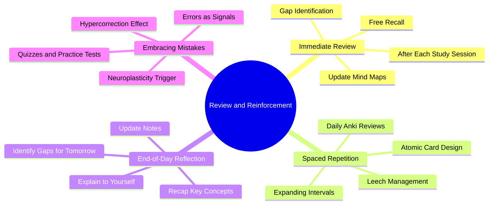

# 6.6 Review and Reinforcement System

The Review and Reinforcement phase of the Linear Method is the system that converts today's learning into long-term memory. Without it, the day's study decays within a week. This note details the four-component review system: immediate review, spaced repetition, end-of-day reflection, and embracing mistakes.

## The Core Principle

Learning does not happen during study. **Learning happens during review and sleep.** Studying encodes fragile traces; review strengthens them; sleep consolidates them. Without review, the traces decay according to the forgetting curve (see [[2.3 Spaced Repetition]]).

The Review and Reinforcement system has four components, each addressing a different timescale:

1. **Immediate review** (minutes) — Within 10 minutes of finishing a study session.
2. **Spaced repetition** (days to months) — Daily reviews via Anki or REMNote.
3. **End-of-day reflection** (hours) — A 10-15 minute recap before bed.
4. **Embracing mistakes** (ongoing) — Active engagement with errors.

## Component 1: Immediate Review

### What to Do

Within 10 minutes of finishing a study session:
1. Close all materials.
2. Spend 5 minutes writing down everything you remember (free recall).
3. Compare your free recall to the material. Identify gaps.
4. Update your notes or mind map with new connections and insights.
5. Spend 5 minutes explaining the day's main concept aloud using the Feynman Technique ([[2.5 The Feynman Technique]]).

### Why

Immediate review exploits the testing effect at the moment the trace is most fragile. The act of retrieving the information immediately after encoding dramatically strengthens the trace, compared to passive re-reading or no review at all.

The free recall also serves as a diagnostic: the gaps you identify become the agenda for tomorrow's pretest and review.

### Common Mistakes

- **Skipping immediate review because "I'll review later."** Later review is consolidation, not the same as immediate retrieval. The immediate retrieval is the high-leverage moment.
- **Reviewing with the book open.** That is re-reading, not retrieval. Close the book.
- **Skipping the Feynman explanation.** Free recall is good; Feynman is better. The synthesis exposes conceptual gaps that free recall misses.

## Component 2: Spaced Repetition

### What to Do

Use Anki or REMNote to schedule spaced reviews of all discrete facts you want to retain long-term.

- **Daily review** (15-30 minutes): Review all cards due today. Aim for 95%+ recall rate on mature cards.
- **New card creation** (5-10 minutes per study session): Add 5-10 atomic cards for new material.
- **Leech management** (weekly): Identify cards that you fail repeatedly. Rewrite or re-study the underlying concept.

### Why

Spaced repetition is the single most evidence-backed long-term retention technique. See [[2.3 Spaced Repetition]] for the algorithm and evidence.

### Card Design Principles

- **Atomic:** One fact per card. Split multi-fact cards into multiple atomic cards.
- **Application over definition:** Prefer "What is the time complexity of quicksort?" over "Define quicksort."
- **Image occlusion for visual material:** For diagrams, anatomy, etc., use image occlusion (cover part, recall what is hidden).
- **Cloze deletion for context-rich facts:** For sentences where the key term is the target, use cloze deletion ("The TCP handshake consists of {{SYN}}, {{SYN-ACK}}, and {{ACK}}.").
- **Brief:** Each card should be answerable in under 10 seconds.

### Common Mistakes

- **Adding too many cards.** 5-10 per session is enough. More becomes a review burden.
- **Adding cards for material you do not understand.** Understand first, then make cards.
- **Skipping daily reviews.** Spaced repetition requires daily engagement. Skipping 3 days creates a backlog that takes a week to clear.
- **Reviewing by recognition.** Force yourself to produce the answer before flipping the card.

## Component 3: End-of-Day Reflection

### What to Do

Before bed (or at the end of your study day), spend 10-15 minutes:

1. **Recapitulate** what you learned today. Explain key concepts to yourself aloud, as if teaching a class.
2. **Identify gaps.** Where did your explanation stumble? What could you not explain clearly?
3. **Plan tomorrow.** Add the gaps to tomorrow's study agenda.
4. **Update your notes.** Add new insights, connections, or corrections to your Obsidian vault.

### Why

The end-of-day reflection serves three purposes:

1. **Retrieval practice.** The recapitulation is another retrieval event, strengthening the day's traces.
2. **Gap identification.** The reflection exposes what you did not actually learn today, so you can address it tomorrow.
3. **Sleep preparation.** Reflecting on the day's learning primes the brain to consolidate that material during sleep. The hippocampus prioritizes recently activated material for replay.

### Common Mistakes

- **Skipping the reflection because "I'm tired."** This is exactly when the reflection is most valuable — it is the bridge to sleep consolidation.
- **Re-reading notes instead of reflecting.** The reflection is retrieval, not review.
- **Not writing down the gaps.** If you do not record the gaps, you will forget them by tomorrow morning.
- **Spending too long.** 10-15 minutes. If you spend an hour, you are doing more than reflection — you are starting a new study session.

## Component 4: Embracing Mistakes

### What to Do

Throughout your study, deliberately engage with mistakes:

1. **Take quizzes and practice tests frequently.** Even when you "aren't ready." Especially when you aren't ready.
2. **When you get a question wrong, mark it.** Do not just move on. Note the question, your wrong answer, the correct answer, and why you were wrong.
3. **Re-attempt wrong questions later.** After a day, a week, a month. Verify that you have learned from the error.
4. **When debugging code, articulate your hypothesis before testing it.** If your hypothesis is wrong, that is a learning signal — note what you got wrong about the notional machine.

### Why

Mistakes trigger the hypercorrection effect (see [[2.4 Pretesting and Hypercorrection]]) and error-driven neuroplasticity. Errors produce a surprise signal in the brain, releasing norepinephrine and dopamine that mark the relevant synapses for retention.

Avoiding mistakes (by waiting until you "feel ready" before testing yourself) eliminates this entire learning mechanism.

### Common Mistakes

- **Avoiding practice tests because "I'm not ready."** The point is to be wrong. The errors are the learning.
- **Getting a question wrong and immediately looking at the answer.** First, attempt to figure out the correct answer yourself. The retrieval attempt (even if it fails) strengthens the trace.
- **Not recording mistakes.** Without a record, you cannot review your error patterns.
- **Treating mistakes as failures.** Mistakes are signals. The feeling of failure is the cue that neuroplasticity is happening.

## The Weekly Review

Once per week (e.g., Sunday evening), conduct a longer review:

1. **Review the week's notes** (30 minutes). Read through your Obsidian vault additions for the week.
2. **Re-attempt the week's practice problems** (30 minutes). Verify that you can still solve them.
3. **Audit your Anki deck** (15 minutes). Identify leeches. Rewrite or re-study them.
4. **Identify the week's main concept.** Write a 1-page summary of what you learned this week.
5. **Plan next week** (15 minutes). Set the week's top 3 goals. Schedule the focus blocks.

The weekly review consolidates the week's learning and prepares the next week's structure.

## The Monthly Review

Once per month, conduct a longer meta-review:

1. **Review the month's notes** (1 hour).
2. **Re-attempt problems from a month ago** (1 hour). Verify long-term retention.
3. **Identify themes and gaps** (30 minutes). What patterns emerged? What is still weak?
4. **Update your vault structure** (30 minutes). Reorganize notes, add cross-references, prune outdated material.
5. **Reflect on the process** (30 minutes). What study techniques worked? What didn't? Adjust the system.

The monthly review prevents drift and ensures the system remains effective over time.

## Common Pitfalls

### Pitfall 1: No Review System

The most common failure. Students study but never review. The forgetting curve ensures that 90% of the material is gone within a week.

### Pitfall 2: Review = Re-Reading

Review by re-reading notes or textbooks is barely better than no review. Review must be retrieval-based (active recall).

### Pitfall 3: Inconsistent Review

Reviewing some days, skipping others. Spaced repetition requires consistency. Skipping days creates backlogs that destroy the schedule.

### Pitfall 4: Review Without Gap Identification

Reviewing without identifying gaps produces no improvement. The gaps are the agenda for future study.

### Pitfall 5: Treating Review as Optional

Review is half of learning. Skipping it halves the value of your study time. Treat review sessions with the same respect as study sessions.

## Cross-References

- The general active recall principle is in [[2.2 Active Recall]].
- The spaced repetition algorithm and tooling are in [[2.3 Spaced Repetition]] and [[8.2 Spaced Repetition Software]].
- The hypercorrection effect is in [[2.4 Pretesting and Hypercorrection]].
- The Feynman Technique is in [[2.5 The Feynman Technique]].
- Sleep as the master consolidation window is in [[3.2 Sleep and Memory Consolidation]].
- The full daily schedule is in [[6.1 MOC - The Linear Method]].

#linear-method #review #reinforcement #spaced-repetition #technique
