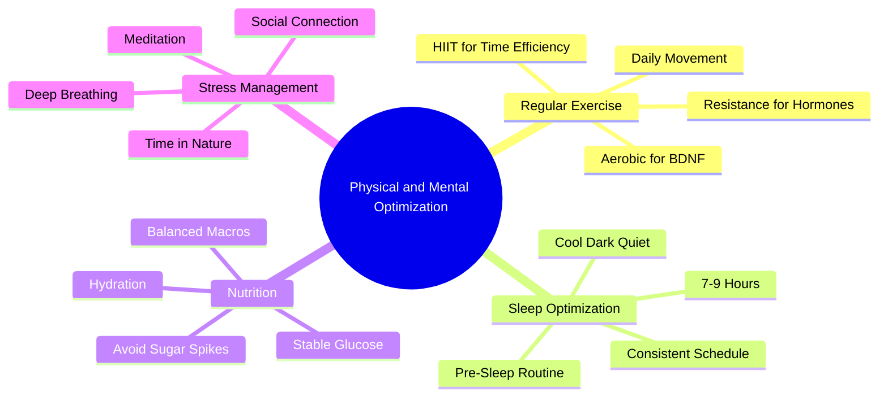

# 6.7 Physical and Mental Optimization

The Physical and Mental Optimization phase of the Linear Method covers the lifestyle factors that support learning: exercise, sleep, nutrition, and stress management. These factors determine the biological ceiling of your cognitive capacity. Without them, even the best techniques underperform. This note details the evidence-based protocols — with all biohacking elements removed.

## The Core Principle

The brain is a biological organ. Its capacity is constrained by physical health. Exercise increases BDNF and supports neuroplasticity. Sleep consolidates memory. Nutrition provides the glucose the brain needs. Stress management prevents chronic cortisol elevation that impairs hippocampal function.

The original Linear Method (from the source material) mixed valid physical optimization with biohacking rituals: Wim Hof breathing for alertness, intermittent fasting for BDNF, 40 Hz therapy, cold immersion for learning. These rituals are bad, terrible, and unsupported by evidence for healthy adults — see [[7.2 Biohacking Myths]]. This implementation keeps only the evidence-based elements.

## Pillar 1: Regular Exercise

### What to Do

Engage in regular physical exercise:
- **Aerobic exercise** (running, cycling, swimming, brisk walking): 150 minutes per week (30 minutes, 5 days per week).
- **Resistance training** (weight lifting, bodyweight exercises): 2-3 sessions per week.
- **Daily movement**: 7,000-10,000 steps per day.

### Why

Exercise is the single most reliable intervention to support brain health and learning:

- **BDNF release:** Aerobic exercise increases BDNF (Brain-Derived Neurotrophic Factor), which supports synaptic plasticity and adult neurogenesis in the hippocampus.
- **Blood flow:** Exercise increases blood flow to the brain, delivering oxygen and glucose.
- **Endorphins:** Exercise releases endorphins, improving mood and reducing stress.
- **Sleep quality:** Regular exercise improves sleep architecture (more SWS, better REM).
- **Stress reduction:** Exercise reduces chronic cortisol elevation.

### What to Do (Concrete)

- **Morning:** 10-20 minutes of light cardio (walking, jogging, stretching) to increase blood flow and alertness. See [[6.2 Preparation - Mind and Environment]].
- **Afternoon:** 30-60 minutes of moderate exercise (run, lift, cycle, swim). This provides a long break during the day (see [[6.5 Breaks and Recovery]]) and supports the afternoon's focus.
- **Evening:** Light walking or stretching. Avoid intense exercise within 3 hours of bedtime (it raises core body temperature and delays sleep onset).

### HIIT (High-Intensity Interval Training)

HIIT — short bursts of intense effort (e.g., 30 seconds sprinting, 90 seconds walking, repeated 8-10 times) — is time-efficient and effective. 20 minutes of HIIT produces similar BDNF release to 60 minutes of moderate exercise.

If you are time-constrained, HIIT 2-3 times per week is sufficient. Combine with daily walking for movement.

### Common Mistakes

- **Overtraining.** Exercising intensely every day without recovery produces inflammation and impairs cognition. Build rest days into your routine.
- **Exercising right before bed.** Raises core body temperature, delays sleep onset. Last intense exercise should be at least 3 hours before bedtime.
- **No exercise at all.** The brain suffers. Even daily walking is better than nothing.

### What to Drop

- **Wim Hof breathing for alertness:** Produces acute arousal via hyperventilation, but the arousal is short-lived and the learning claims are unsupported. Light exercise is more effective and sustainable. See [[7.2 Biohacking Myths]].
- **Cold immersion for "neuroplasticity":** Cold exposure triggers a stress response (adrenaline, noradrenaline) that produces subjective alertness but has no direct evidence of accelerating learning in educational contexts. See [[7.2 Biohacking Myths]].

## Pillar 2: Sleep Optimization

### What to Do

Sleep 7-9 hours per night, consistently, with proper sleep hygiene. See [[3.2 Sleep and Memory Consolidation]] for the full protocol.

The key elements:
- Same sleep and wake times every day, including weekends.
- No screens 60 minutes before bed.
- No caffeine within 8 hours of bedtime.
- No alcohol within 3 hours of bedtime.
- Cool (18-20°C), dark, quiet room.
- Consistent pre-sleep routine.

### Why

Sleep is non-negotiable for learning. Sleep is when memory consolidation happens. Skipping sleep sacrifices the entire benefit of the day's study.

See [[3.2 Sleep and Memory Consolidation]] for the detailed mechanism.

### Sleep Before and After Learning

Sleep serves two windows:
- **Sleep before learning** — prepares the hippocampus to encode new information. A sleep-deprived hippocampus has ~40% reduced encoding capacity.
- **Sleep after learning** — consolidates the day's learning via hippocampal replay and neocortical transfer.

Both windows must be present. Pulling an all-nighter to study sacrifices both.

## Pillar 3: Nutrition

### What to Do

Eat a balanced diet that supports stable blood glucose:

- **Complex carbohydrates** (oats, whole grains, legumes, vegetables) for sustained glucose.
- **Protein** (eggs, fish, poultry, beans, tofu) for amino acids.
- **Healthy fats** (avocado, nuts, olive oil, fatty fish) for sustained energy and omega-3 fatty acids.
- **Plenty of water** — the brain is ~75% water; even mild dehydration impairs cognition.
- **Limit sugar** — sugary foods and drinks produce insulin spikes and reactive hypoglycemia ("brain fog").

### Why

The brain consumes ~20% of the body's glucose. Stable glucose supply is essential for sustained executive function, working memory, and complex problem-solving. Large glucose spikes (from sugary foods) produce reactive hypoglycemia, which impairs cognition 60-90 minutes after the meal.

### What to Drop

- **Intermittent fasting for "BDNF and mental clarity":** The cognitive benefits of short-term fasting are overstated. Fasting can induce mild hypoglycemia, which impairs working memory in tasks requiring high executive function. Maintaining stable low-glycemic meals is better for sustained cognition than fasting. See [[7.2 Biohacking Myths]].
- **"Brain-boosting" supplements:** Most nootropics have weak or no evidence in healthy adults. Save your money.

### Specific Foods

The evidence for specific "brain foods" is mixed, but the following have moderate support:
- **Fatty fish** (salmon, sardines) — omega-3 fatty acids (DHA, EPA) support brain health.
- **Nuts and seeds** — healthy fats, vitamin E.
- **Berries** — antioxidants; some evidence for cognitive benefits.
- **Dark chocolate** — flavonoids, caffeine, theobromine. Moderate consumption is fine.
- **Coffee and tea** — caffeine (in moderation) improves alertness and cognitive performance. Tea provides L-theanine, which produces smoother alertness.

## Pillar 4: Stress Management

### What to Do

Manage chronic stress through:
- **Deep breathing** — box breathing (4 seconds in, 4 seconds hold, 4 seconds out, 4 seconds hold) for 5 minutes.
- **Meditation** — 10-20 minutes daily. Use guided apps (Headspace, Calm, Waking Up) if you are a beginner.
- **Social connection** — spend time with friends and family. Social isolation is a major chronic stressor.
- **Time in nature** — 30+ minutes per week in natural environments reduces cortisol.
- **Journaling** — write down worries and concerns. Externalizing them reduces their cognitive load.

### Why

Chronic stress elevates cortisol. Chronic cortisol elevation:
- Impairs hippocampal function (the hippocampus has high cortisol receptor density).
- Reduces adult neurogenesis.
- Impairs prefrontal cortex function (executive function, working memory).
- Disrupts sleep architecture.

Acute stress (a single deadline) is fine; the brain recovers quickly. Chronic stress (months of high cortisol) degrades cognition.

### What to Drop

- **Wim Hof breathing as a stress management technique:** While some evidence supports Wim Hof breathing for immune function and acute arousal, it is not a substitute for the foundational stress management practices (sleep, exercise, social connection, meditation). The "stress resilience" claims are overstated. See [[7.2 Biohacking Myths]].

## The Daily Optimization Protocol

A sample daily protocol integrating all four pillars:

| Time | Activity | Pillar |
|------|----------|--------|
| 06:30 | Wake, drink water | Sleep, Nutrition |
| 06:30-06:45 | Light stretching | Exercise |
| 06:45-07:15 | Balanced breakfast | Nutrition |
| 07:15-07:30 | 10 min meditation | Stress |
| 07:30-12:30 | Study blocks with breaks | — |
| 12:30-13:30 | Lunch, walk | Nutrition, Exercise |
| 13:30-15:30 | Study blocks with breaks | — |
| 15:30-16:30 | Exercise (run, lift, HIIT) | Exercise |
| 16:30-17:00 | Shower, snack | — |
| 17:00-19:00 | Study blocks or admin | — |
| 19:00-20:00 | Dinner with friends/family | Nutrition, Stress |
| 20:00-21:00 | Walk or read | Stress, Exercise |
| 21:00-21:30 | Journal, plan tomorrow | Stress |
| 21:30-22:00 | Wind down (no screens) | Sleep |
| 22:00-06:30 | Sleep (8.5 hours) | Sleep |

This protocol includes all four pillars daily. The specific times will adapt to your life, but the structure (morning routine, study blocks, exercise, dinner, wind down, sleep) should remain.

## Common Pitfalls

### Pitfall 1: Sacrificing Sleep to "Optimize" More

The most common failure. Sacrificing sleep to exercise more, study more, or meditate more is self-defeating. Sleep is the foundation; everything else builds on it.

### Pitfall 2: Adding Biohacking Rituals

Cold showers, Wim Hof breathing, 40 Hz therapy, salt-lemon water, intermittent fasting for BDNF. These rituals feel productive but produce no measurable learning benefit. They are procrastination disguised as optimization. Drop them.

### Pitfall 3: Inconsistent Exercise

Exercising intensely for 2 weeks, then not at all for 2 months. Consistency matters more than intensity. Better to walk daily than to sprint weekly.

### Pitfall 4: Poor Nutrition Choices

Sugary breakfasts, skipped meals, heavy dinners. All disrupt glucose stability and impair cognition.

### Pitfall 5: Ignoring Chronic Stress

Treating stress as a personal weakness rather than a biological factor that impairs cognition. Manage it actively.

## Cross-References

- Sleep protocol is in [[3.2 Sleep and Memory Consolidation]].
- The myth debunkings are in [[7.2 Biohacking Myths]].
- The morning routine is in [[6.2 Preparation - Mind and Environment]].
- The exercise-as-break principle is in [[6.5 Breaks and Recovery]].
- The full daily schedule is in [[6.1 MOC - The Linear Method]].

#linear-method #physical #mental #optimization #technique
