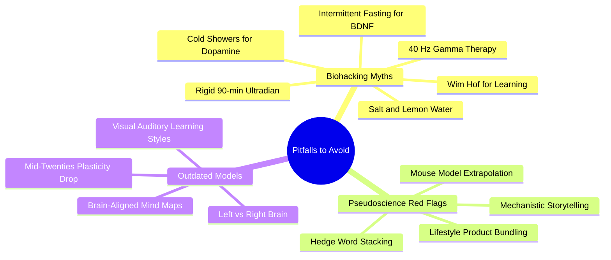

# 7.1 MOC - Pitfalls and Pseudoscience to Avoid

This chapter is a quarantine zone. The ideas catalogued here are **bad, terrible, and scientifically unsupported.** They are listed briefly so you can recognize and avoid them, not so you can practice them. Do not waste a single minute of your study time on these rituals.

> [!warning] Why This Chapter Exists
> The modern "learning advice" market is flooded with pop-neuroscience packaged as biohacking. These trends sound scientific because they use words like *dopamine*, *BDNF*, *gamma waves*, and *ultradian rhythms*. They are designed to make basic, boring productivity advice ("sit down, test yourself, get enough sleep") sound like cutting-edge neurobiology — usually to sell courses, supplements, or podcasts. The techniques themselves do not work, and several are actively harmful.

## Mermaid Mind Map - Chapter 7

## Notes in This Chapter

- [[7.2 Biohacking Myths]] — Brief, dismissive warnings about each specific myth (salt water, cold showers for dopamine, 40 Hz therapy, fasting for BDNF, rigid ultradian cycles, etc.).
- [[7.3 Identifying Pseudoscience]] — A pattern-matching guide: how to spot pop-neuroscience in the wild.

## The Replacement Principle

For every myth, there is a boring, evidence-based replacement that does the same job better. The general pattern is:

- **Myth:** A biohacking ritual that "optimizes" some biological mechanism.
- **Replacement:** A behavioral or environmental intervention that does the same thing, with actual evidence.

| Myth | Replacement |
|------|-------------|
| Salt-lemon water for hydration | Plain water; your kidneys handle electrolytes |
| Cold showers for dopamine | Reduce distractions; manage cognitive load |
| 40 Hz gamma therapy for focus | Noise-cancelling headphones; pink noise |
| Intermittent fasting for BDNF | Stable low-glycemic meals; consistent energy |
| Rigid 90-min ultradian blocks | Self-regulated focus; monitor error rate |
| Wim Hof breathing for alertness | A short walk; caffeine in moderation |
| "Mid-twenties plasticity drop-off" | Adult neuroplasticity via acetylcholine + sleep |

## Cross-References

- The foundations that refute the "plasticity drop-off" myth are in [[1.3 Neuroplasticity Across the Lifespan]].
- The valid alternative to rigid ultradian blocks is in [[4.4 Flexible Focus vs Rigid Blocks]].
- The valid alternative to "dopamine hacking" is in [[1.4 The Six Critical Ingredients of Learning]] (specifically the "Alertness" and "Attention" ingredients).

#moc #pitfall #pseudoscience #warning
