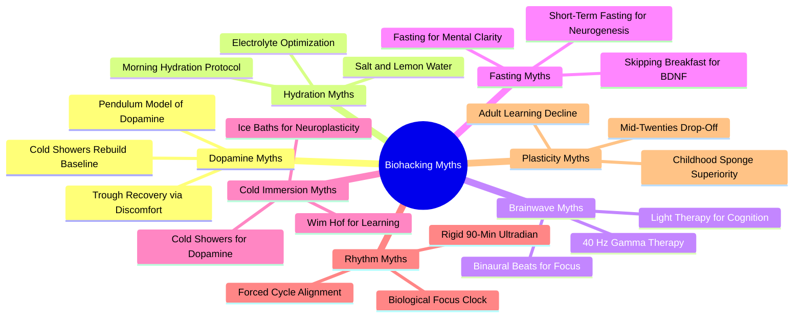

# 7.2 Biohacking Myths

This note catalogs the most common biohacking myths that surround modern "learning advice." Each myth is **bad, terrible, and scientifically unsupported.** They are listed here briefly so you can recognize and avoid them — not so you can practice them.

> [!warning] The Replacement Principle
> For every myth, there is a boring, evidence-based replacement that does the same job better. The general pattern: biohacking rituals "optimize" some biological mechanism via uncomfortable or esoteric interventions; the replacement is a behavioral or environmental intervention that does the same thing, with actual evidence.

## The Myths

## Myth 1: The Dopamine Trough and Recovery via Discomfort

**The claim:** The brain operates on a pendulum of dopamine peaks and troughs. A high peak produces a deep, painful trough. To recover, you must engage in uncomfortable activities (cold showers, intense exercise) to "rebuild your dopamine baseline."

**Why it's bad:** This is a mechanical visualization of a complex neuromodulatory system. Dopamine does not behave like a pendulum or a fuel tank. It acts as a signaling molecule in distinct parallel pathways (mesolimbic for reward, nigrostriatal for motor control, tuberoinfundibular for prolactin regulation). The "trough" is actually a transient dip in phasic firing below the tonic baseline, signaling a negative prediction error — not a "depletion."

**Why cold showers don't fix it:** Cold shock triggers a massive systemic sympathetic nervous system response, flooding your system with peripheral adrenaline and noradrenaline. This produces a subjective state of high arousal, but the catecholamine surge is largely peripheral, not central. Shocking your body with pain does not magically sensitize your D2 receptors or replenish vesicular dopamine pools; it simply activates your body's survival-stress response.

**The replacement:** Treat motivation and cognitive recovery as resource allocation and state management. Reduce prefrontal cortex load. Remove distractor threads (notifications). Use behavioral conditioning (task-association cues) to reduce the activation energy required to start a task. Get adequate sleep, which actually restores cognitive function.

## Myth 2: Morning Salt and Lemon Water

**The claim:** Drinking water with a pinch of salt and lemon first thing in the morning is a crucial scientific protocol to "rehydrate," "replace electrolytes lost overnight," and "optimize neural signaling."

**Why it's bad:** The human body maintains fluid and electrolyte homeostasis through the Renin-Angiotensin-Aldosterone System (RAAS) and vasopressin. Unless you are severely dehydrated from clinical illness, extreme physical exertion in high heat, or a rare medical condition (hyponatremia), your body does not lose significant sodium overnight. In a modern diet already oversaturated with sodium, adding more salt to morning water poses a cardiovascular risk (hypertension) without any measurable cognitive benefit.

**The replacement:** Drink a glass of plain water on waking. Allow your kidneys, hypothalamic osmoreceptors, and adrenal glands to handle electrolyte regulation. Do not over-engineer a process your biological hardware handles with 99.9% efficiency.

## Myth 3: Rigid 90-Minute Ultradian Rhythm

**The claim:** The human brain operates on strict 90-minute "ultradian rhythms" during wakefulness. You must align your study sessions with these biological cycles (90 minutes of focus followed by 15-30 minutes of break) to maximize cognitive function.

**Why it's bad:** This is an over-extrapolation of Nathaniel Kleitman's Basic Rest-Activity Cycle (BRAC). BRAC is a real, well-documented phenomenon during *sleep* (the 90-120 minute cycles of NREM and REM). The scientific consensus does not support the existence of a rigid, identical 90-minute metabolic or cognitive cycle during *wakefulness*. Waking human attention is highly elastic and dynamic. It is governed by task-induced motivation, executive control networks, task difficulty, and adenosine accumulation — not a clockwork biological metronome.

**The replacement:** Treat focus as a dynamic, load-dependent resource. Use flexible, self-regulated focus. Monitor your error rate and subjective fatigue. Take a break when performance dips, not when a timer tells you to. See [[4.4 Flexible Focus vs Rigid Blocks]].

## Myth 4: 40 Hz Gamma Wave Entrainment

**The claim:** Healthy individuals should use 40 Hz auditory or visual stimulation (light therapy) to stimulate gamma brainwave activity to improve cognitive function, memory, and focus.

**Why it's bad:** This takes a specialized clinical intervention designed for neurodegenerative pathology and misapplies it as a performance hack for healthy brains. 40 Hz sensory stimulation has shown promise in animal models and clinical trials specifically for Alzheimer's disease and Mild Cognitive Impairment (the mechanism involves triggering microglia to clear amyloid-beta plaques). A healthy adult brain does not have pathological plaque accumulation. There is no robust, replicated scientific evidence showing 40 Hz stimulation provides net-positive cognitive enhancement in healthy adults. In fact, several studies on 40 Hz binaural beats in healthy cohorts show the constant sensory input actually *decreases* cognitive control by acting as an auditory distractor.

**The replacement:** Optimize your acoustic environment with passive noise isolation or active noise cancellation. If you prefer background audio, use static, non-tonal masks (pink or brown noise), which reduce the cognitive impact of the "irrelevant speech effect" without acting as a distractor.

## Myth 5: Intermittent Fasting for BDNF and Mental Clarity

**The claim:** You should practice intermittent fasting to boost BDNF, support neurogenesis, and achieve superior "mental clarity" and focus during study sessions.

**Why it's bad:** The claim massively over-extrapolates evolutionary biology and rodent studies. In animal models, severe caloric restriction upregulates BDNF as a survival mechanism (inducing neuroplasticity to help the starving animal remember where to find food). There is no clinical evidence that skipping breakfast or practicing short-term 16:8 fasting significantly boosts adult hippocampal neurogenesis or translates to immediate cognitive superiority in humans.

In fact, cognitive tasks requiring high executive function, logical reasoning, and active working memory (such as debugging complex software) are highly energy-intensive. The brain consumes ~20% of the body's glucose. Fasting can induce mild hypoglycemia, which triggers a systemic stress response (cortisol, adrenaline). Some misinterpret this stress-induced cortisol spike as "sharp focus," but it actually impairs working memory, increases error rates, and reduces cognitive flexibility.

**The replacement:** Treat your brain as a system requiring stable power input. Avoid massive insulin spikes by consuming low-glycemic, complex carbohydrates and proteins. Maintain stable blood glucose to ensure your prefrontal cortex has a reliable, uninterrupted stream of metabolic fuel.

## Myth 6: Cold Immersion and Wim Hof for Learning

**The claim:** Cold exposure (cold showers, ice baths) and Wim Hof breathing directly accelerate learning, enhance neural plasticity, and improve cognitive function.

**Why it's bad:** Cold exposure triggers a massive release of adrenaline and noradrenaline (which produces acute arousal and alertness). But the claim that it directly accelerates learning or neural plasticity in educational contexts lacks robust, direct clinical evidence. It is a stress response packaged as a cognitive enhancer.

Wim Hof breathing produces hyperventilation, hypocapnia, and a temporary altered state of consciousness. The acute arousal is real; the cognitive benefits for sustained study are unproven. The technique also carries risks (hypoxia, fainting, especially in water).

**The replacement:** For alertness, use moderate caffeine (100-200mg), light exercise (10-minute walk), and adequate sleep. These produce sustained alertness without the acute stress response. For neuroplasticity, the proven interventions are: focused attention (acetylcholine release), adequate sleep (hippocampal replay), aerobic exercise (BDNF release), and error-driven learning (norepinephrine release from mistakes).

## Myth 7: Mid-Twenties Plasticity Drop-Off

**The claim:** Neuroplasticity declines gradually as we age, with a "significant drop in learning ability starting in our mid-twenties."

**Why it's bad:** This is an outdated, overly rigid view of neurodevelopment. While childhood is characterized by passive hyper-plasticity, the narrative that your brain's ability to learn experiences a "significant drop-off" in your mid-twenties is a myth. In fact, the prefrontal cortex (responsible for complex logic, executive control, and system design) does not reach full maturity until approximately age 25. Adult brains are highly plastic; the *mechanism* changes (passive absorption becomes directed compilation), but the capacity remains.

**The replacement:** Understand that adult learning is a directed compilation process, not a passive one. To trigger adult neuroplasticity, you must actively lock in your attention (releasing acetylcholine) and embrace the cognitive strain and errors of a difficult task. Do not worry about an arbitrary biological "expiration date" for learning. See [[1.3 Neuroplasticity Across the Lifespan]].

## Myth 8: Mind Mapping Aligns With the Brain's Natural Structure

**The claim:** Mind maps align with the brain's "natural radial structure" of organizing information. Traditional linear note-taking is biologically inferior.

**Why it's bad:** The brain does not organize, store, or retrieve semantic concepts in a literal 2D radial spider-web pattern. Semantic memory is structured as high-dimensional, non-linear connectionist networks distributed across vast cortical areas. The "brain-aligned" claim is pseudoscientific marketing.

**The replacement:** Choose whatever note-taking format (hierarchical outlines, markdown documents, visual diagrams) has the lowest friction for your workflow. Focus entirely on the cognitive depth of your interaction with the material: actively explain *why* concepts are connected (elaborative interrogation) and routinely test your ability to reconstruct the information from scratch without looking at your notes (Active Recall). See [[2.7 Mind Mapping (Properly Understood)]].

## Myth 9: Visual vs. Auditory Learning Styles

**The claim:** People have specific "learning styles" (visual, auditory, kinesthetic) and learn best when material is presented in their preferred style.

**Why it's bad:** This is the most thoroughly debunked neuromyth in education. Decades of research (Pashler et al., 2008) have found no evidence that matching instruction to a learner's "preferred style" improves learning. The preference is real (people have preferences), but the benefit is not (matching the preference does not improve outcomes).

**The replacement:** Match the format to the *content*, not to the learner. Use visual formats for spatial and structural information (anatomy, architecture, geometry). Use auditory formats for temporal and sequential information (music, language pronunciation). Use kinesthetic formats for procedural skills (surgery, sports, instrument playing). The format should serve the content, not a mythical "style."

## Myth 10: "Brain-Boosting" Supplements and Nootropics

**The claim:** Various supplements (L-theanine, lion's mane, racetams, ashwagandha, etc.) enhance cognitive function in healthy adults.

**Why it's bad:** The evidence for most nootropics in healthy adults is weak, mixed, or absent. Many studies are small, poorly controlled, or funded by supplement manufacturers. The effects, when present, are typically small (5-10% improvement on specific cognitive tests) and may not translate to real-world learning. Some supplements have side effects or interact with medications.

**The replacement:** Save your money. The interventions that actually improve cognition in healthy adults are: sleep, exercise, nutrition, stress management, and evidence-based learning techniques (active recall, spaced repetition). None of these come in pill form.

## The Pattern: How to Spot a Biohacking Myth

Most biohacking myths share these features:

1. **Mechanistic storytelling** — invokes a biological mechanism (dopamine, BDNF, gamma waves) in a simplified, often incorrect way.
2. **Mouse model extrapolation** — takes a finding from rodent studies and applies it to healthy humans without acknowledging the translation gap.
3. **Lifestyle product bundling** — the myth is often paired with a product (supplement, device, course) being sold.
4. **Hedge word stacking** — "may support," "is associated with," "has been shown to" (without specifying in whom or how strongly).
5. **Discomfort as virtue** — the intervention is uncomfortable (cold, hunger, breath-holding), and the discomfort is framed as evidence of effectiveness.
6. **Anecdotal testimonials** — case studies and personal stories presented as evidence, without controlled comparison.
7. **Reverse-engineered from outcomes** — "X increases BDNF; BDNF is associated with learning; therefore X improves learning" (the syllogism is invalid because correlation is not causation and the magnitudes are wrong).

When you encounter a claim with these features, be skeptical. Look for randomized controlled trials in healthy human adults, with realistic dosages and meaningful outcome measures.

## Cross-References

- The valid alternative to myth 1 (dopamine troughs) is in [[1.4 The Six Critical Ingredients of Learning]] (alertness ingredient) and [[6.4 Productivity and Task Management]].
- The valid alternative to myth 3 (rigid 90-min) is in [[4.4 Flexible Focus vs Rigid Blocks]].
- The valid alternative to myth 7 (plasticity drop-off) is in [[1.3 Neuroplasticity Across the Lifespan]].
- The valid alternative to myth 8 (mind maps) is in [[2.7 Mind Mapping (Properly Understood)]].
- The pattern-recognition guide for spotting pseudoscience is in [[7.3 Identifying Pseudoscience]].

#pitfall #pseudoscience #biohacking #myths #warning
