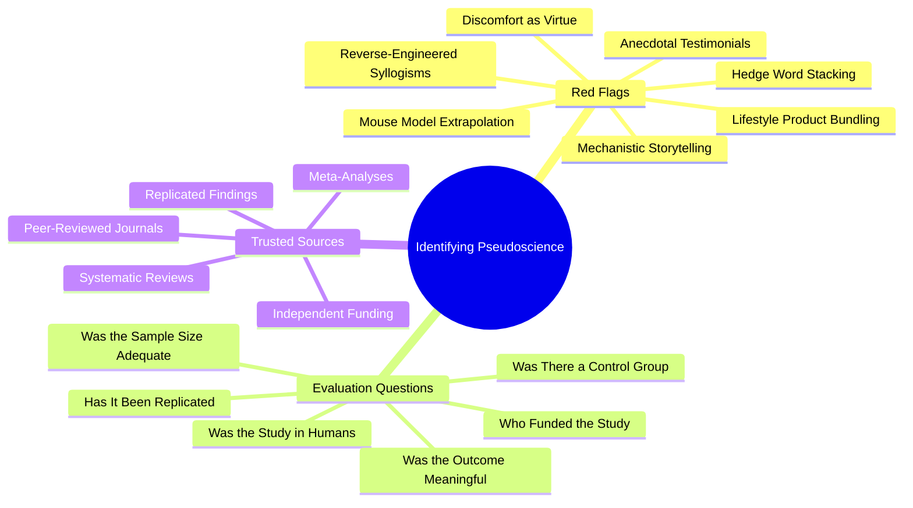

# 7.3 Identifying Pseudoscience

Pop-neuroscience is everywhere. Podcasts, YouTube channels, bestselling books, and Instagram infographics routinely present biological mechanisms in ways that sound scientific but are not. This note is a pattern-matching guide: how to spot pop-neuroscience in the wild, and how to evaluate learning advice for scientific credibility.

## The Core Principle

The volume of "learning advice" available has exploded. Most of it is recycled, untested, or actively wrong. Without a filter, you will waste time on rituals that produce no benefit (and may be harmful). The filter is critical thinking applied to specific red flags.

## Red Flag 1: Mechanistic Storytelling

**The pattern:** The advice explains a biological mechanism in a way that sounds precise but is actually a simplified, often incorrect story.

**Examples:**
- "Cold showers rebuild your dopamine baseline."
- "40 Hz therapy stimulates gamma waves for cognitive enhancement."
- "Fasting boosts BDNF for neurogenesis."
- "Salt water optimizes neural signaling."

**Why it's a red flag:** The mechanisms cited are real biological entities (dopamine, gamma waves, BDNF, sodium), but the *relationships* claimed are typically over-simplified or unsupported. The storyteller takes a real biological fact and chains it to an intervention without establishing that the intervention produces the claimed effect at meaningful magnitudes in healthy humans.

**How to evaluate:** Ask: "Is the mechanism described accurately? Is the intervention shown to actually affect the mechanism? At what magnitude? In healthy humans?"

## Red Flag 2: Mouse Model Extrapolation

**The pattern:** The advice cites a study in mice or rats and applies the finding to healthy humans.

**Examples:**
- "Fasting increases neurogenesis in mice, so skipping breakfast will make you smarter."
- "Caloric restriction extends lifespan in mice, so intermittent fasting will extend yours."
- "BDNF increases in mice after exercise, so HIIT will boost your learning."

**Why it's a red flag:** Mouse models are valuable for hypothesis generation, but the translation to humans is unreliable. Mice have different metabolisms, different lifespans, different brain-to-body ratios, and different disease models. A finding in mice is a starting point, not a conclusion. Many findings that hold in mice do not replicate in humans.

**How to evaluate:** Ask: "Was the study in humans? If in mice, has the finding been replicated in humans? Are the dosages comparable (after body-weight scaling)?"

## Red Flag 3: Hedge Word Stacking

**The pattern:** The advice uses vague, non-committal language that sounds scientific but commits to nothing.

**Examples:**
- "May support cognitive function."
- "Is associated with improved memory."
- "Has been shown to enhance focus."
- "Plays a role in neuroplasticity."

**Why it's a red flag:** These phrases are technically true of almost anything. Coffee "may support cognitive function." Sleep "is associated with improved memory." Exercise "has been shown to enhance focus." The hedged language is used to imply a stronger claim than the evidence supports, while preserving plausible deniability.

**How to evaluate:** Ask: "What is the effect size? In what population? Under what conditions? Compared to what control?" If the advice cannot answer these questions specifically, the claim is too vague to be actionable.

## Red Flag 4: Lifestyle Product Bundling

**The pattern:** The advice is paired with a product being sold: a supplement, a device, a course, a coaching program, a subscription.

**Examples:**
- "40 Hz gamma therapy for focus" → paired with a $400 light therapy device.
- "Adaptogens for stress" → paired with a $60/month supplement subscription.
- "The science of learning" → paired with a $500 course on "neuro-optimized study."

**Why it's a red flag:** The financial incentive creates a conflict of interest. The advice is motivated by the product sale, not by disinterested evaluation of the evidence. Even when the advice is partially correct, the magnitudes are typically overstated to justify the purchase.

**How to evaluate:** Ask: "Is the seller profiting from the advice? Is there a free, evidence-based alternative? Does the product's claims survive evaluation by independent sources (Cochrane reviews, independent replication studies)?"

## Red Flag 5: Discomfort as Virtue

**The pattern:** The intervention is uncomfortable (cold, hunger, breath-holding, pain), and the discomfort is framed as evidence of effectiveness.

**Examples:**
- "Cold showers are painful because they're working."
- "Fasting is hard because your brain is adapting."
- "Wim Hof breathing is intense because it's hacking your nervous system."

**Why it's a red flag:** Discomfort is not evidence of effectiveness. Discomfort is evidence of a stress response. Stress responses produce subjective arousal, which can feel like cognitive enhancement, but the arousal is often short-lived and the long-term benefits are unproven.

The most evidence-backed learning interventions (sleep, exercise, active recall, spaced repetition) are not uncomfortable. They are effortful but not painful. The "no pain, no gain" framing is a marketing tactic, not a scientific principle.

**How to evaluate:** Ask: "Is the discomfort necessary for the effect? Is there a less uncomfortable alternative with similar or better evidence?"

## Red Flag 6: Anecdotal Testimonials

**The pattern:** The advice is supported by personal stories and case studies, not controlled comparisons.

**Examples:**
- "I started taking cold showers and my focus improved."
- "After I started fasting, my coding productivity doubled."
- "Thousands of students have used this method to ace their exams."

**Why it's a red flag:** Anecdotes suffer from selection bias, confirmation bias, placebo effects, and regression to the mean. The person who improved after starting cold showers might have improved anyway (regression to the mean), might have improved due to other changes (better sleep, more exercise), or might be retrospectively emphasizing improvements and ignoring declines.

Controlled studies exist precisely to control for these biases. Anecdotes are starting points for hypotheses, not evidence for conclusions.

**How to evaluate:** Ask: "Has this been tested in a randomized controlled trial? With a control group? With objective outcome measures? Has it been replicated?"

## Red Flag 7: Reverse-Engineered Syllogisms

**The pattern:** The advice takes a real biological finding and chains it to an intervention via an invalid syllogism.

**Examples:**
- "BDNF supports neuroplasticity. Fasting increases BDNF in mice. Therefore fasting improves learning in humans."
- "Dopamine is involved in motivation. Cold showers spike dopamine. Therefore cold showers improve motivation."
- "Slow-wave sleep consolidates memory. 40 Hz therapy affects brainwaves. Therefore 40 Hz therapy improves memory."

**Why it's a red flag:** Each link in the syllogism might be individually true, but the chain is invalid. The magnitudes may be wrong (the BDNF increase from fasting may be too small to matter). The populations may differ (mouse BDNF vs. human BDNF). The outcomes may not translate (acute vs. chronic effects). The mechanism may be more complex (dopamine has multiple pathways with different functions).

**How to evaluate:** Ask: "Is each link in the chain established in the relevant population, at the relevant magnitude, with the relevant outcome?"

## The Evaluation Checklist

When you encounter new learning advice, ask these questions:

### Question 1: Was the study in humans?

Mouse and rat studies are starting points, not conclusions. Look for human studies, ideally in healthy adults (not just clinical populations).

### Question 2: Was the sample size adequate?

Studies with fewer than 30 participants per group have low statistical power. Look for studies with 100+ participants, or meta-analyses combining multiple studies.

### Question 3: Was there a control group?

Without a control group, you cannot distinguish the intervention's effect from placebo, regression to the mean, or other confounders. Look for randomized controlled trials (RCTs).

### Question 4: Was the outcome meaningful?

Lab-based cognitive tests (reaction time, working memory span) may not translate to real-world learning. Look for studies with ecologically valid outcomes (exam performance, skill acquisition, retention over weeks).

### Question 5: Has it been replicated?

A single study, no matter how well-designed, can be a false positive. Look for replications in independent labs, ideally with pre-registered protocols.

### Question 6: Who funded the study?

Industry-funded studies are more likely to report positive findings than independently funded studies. Look for disclosures of funding sources and conflicts of interest.

### Question 7: Is the effect size practically meaningful?

A statistically significant effect may be practically meaningless. A 2% improvement in reaction time is not worth restructuring your study routine. Look for effect sizes (Cohen's d) of 0.5 or higher (medium to large).

## Trusted Sources

When evaluating learning advice, prioritize these sources:

### Tier 1: Strong Evidence

- **Peer-reviewed journals** with high impact factors (Nature, Science, Psychological Science, Journal of Experimental Psychology).
- **Systematic reviews and meta-analyses** (Cochrane reviews, Campbell Collaboration).
- **Replicated findings** in independent labs.

### Tier 2: Moderate Evidence

- **Single peer-reviewed studies** in reputable journals.
- **Textbooks** by recognized experts (e.g., *Cognition* by Reisberg, *Make It Stick* by Brown et al.).
- **Review articles** in Annual Review of Psychology.

### Tier 3: Weak Evidence (Use With Caution)

- **Conference papers** (not yet peer-reviewed).
- **Pre-prints** (not yet peer-reviewed).
- **Books and articles** by practitioners without research credentials.

### Tier 4: Not Evidence

- **Podcasts** by celebrity scientists presenting selected findings without critique.
- **YouTube videos** by influencers without research credentials.
- **Instagram infographics** and TikToks.
- **Anecdotal testimonials**.
- **Marketing materials** from supplement or device manufacturers.

Note: Podcasts and YouTube videos can be excellent entry points to a topic, but they should not be your final source. Always trace claims back to the primary literature.

## The Meta-Principle

The single most reliable indicator of evidence-based advice is **boringness**. Real learning science — active recall, spaced repetition, sleep, exercise — is mundane. It does not require cold showers, supplements, or esoteric devices. It does not promise dramatic results in 24 hours. It does not have a catchy brand name.

If the advice sounds exciting, novel, or "hacked," be skeptical. If it sounds boring, repetitive, and resembles what your grandmother told you (sleep well, eat breakfast, exercise, study consistently), it is probably evidence-based.

## Cross-References

- The specific myths catalogued in [[7.2 Biohacking Myths]] are case studies of these red flags.
- The valid techniques in [[2.1 MOC - Learning Techniques]] are the boring, evidence-based replacements.
- The references in [[9.2 Bibliography]] are the trusted sources to consult for primary literature.

#pitfall #pseudoscience #critical-thinking #warning
