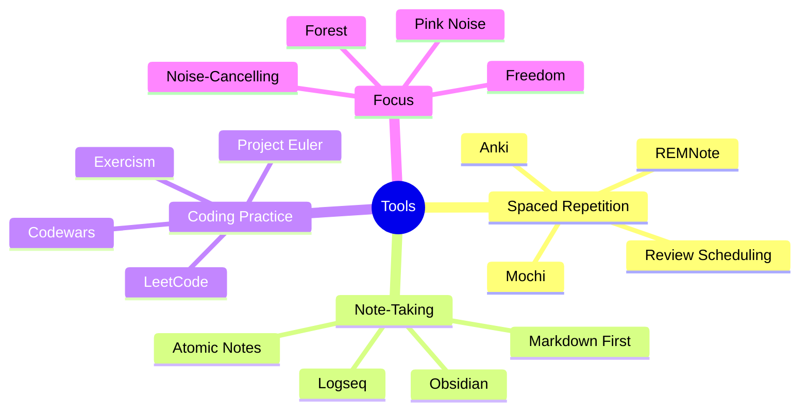

# 8.1 MOC - Tools and Workflow

Tools do not learn for you. But the wrong tools create friction that quietly destroys your consistency. This chapter reviews the software and workflows that align with the evidence-based techniques in this vault. The list is intentionally short — every tool here earns its place by removing a specific bottleneck in the learning pipeline.

## Mermaid Mind Map - Chapter 8

## Notes in This Chapter

- [[8.2 Spaced Repetition Software]] — Anki, REMNote, Mochi. How to choose, and how to write good cards.
- [[8.3 Note-Taking Apps]] — Why Obsidian and Logseq (local-first markdown) beat Notion and Evernote for learning.
- [[8.4 Focus and Distraction-Blocking Tools]] — Freedom, Forest, noise-cancelling headphones, pink noise.

## Tool Selection Principles

1. **Local-first over cloud-locked.** Your notes should outlive the company that hosts them. Plain markdown in a local folder is the most durable format.
2. **Open over proprietary.** Open-source tools let you inspect, extend, and migrate. Anki's open format is why it has survived 15+ years.
3. **Single-purpose over all-in-one.** A tool that does everything does nothing well. Use a separate tool for each function: Anki for SRS, Obsidian for notes, LeetCode for coding practice.
4. **Friction matters more than features.** A 2-second delay to create a flashcard means you will create 30% fewer flashcards. Optimize for friction.
5. **Avoid subscription traps.** If a tool requires a monthly subscription to access your own notes, the incentive structure is misaligned with your learning.

## Cross-References

- Anki workflow is integrated into [[6.6 Review and Reinforcement System]].
- The Obsidian vault structure itself follows the principles in [[8.3 Note-Taking Apps]].
- Coding practice platforms serve as the practice ground for [[5.6 Retrieval Practice for Algorithmic Thinking]].

#moc #tool #workflow #software
