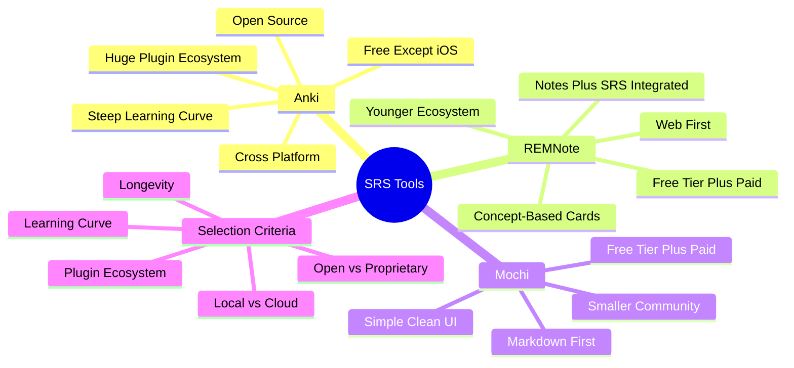

# 8.2 Spaced Repetition Software

Spaced repetition software (SRS) automates the scheduling of review sessions described in [[2.3 Spaced Repetition]]. This note reviews the three dominant tools — Anki, REMNote, and Mochi — and provides a card-design workflow.

## The Core Principle

A spaced repetition tool's job is to:
1. Show you cards when they are due for review.
2. Track your performance on each card.
3. Adjust the next review interval based on your performance.

All three tools do this. The differences are in card design philosophy, ecosystem, and tooling.

## Tool 1: Anki

### What It Is

Anki is the dominant SRS, developed by Damien Elmes in 2006. Open-source (GPL), cross-platform (Windows, Mac, Linux, Android, iOS, web), free on all platforms except iOS ($25 one-time, which supports development).

### Strengths

- **Open format:** Cards are stored as plain text in a SQLite database. You can export, migrate, and back up freely.
- **Plugin ecosystem:** Hundreds of community plugins (image occlusion, fuzzy grading, batch editing, etc.).
- **Mature:** 18+ years of development. Stable, well-documented, well-supported.
- **Cross-platform sync:** Free cloud sync via AnkiWeb.
- **Strong community:** Large user base, extensive documentation, active forums.

### Weaknesses

- **Steep learning curve:** The UI is dated and unintuitive. Card creation requires understanding of note types, templates, and fields.
- **No native note-taking:** Anki is purely for flashcards. You must maintain separate notes.
- **No concept-based card creation:** Each card is independent; no automatic linking between related concepts.

### Best For

- Learners who want maximum control and customization.
- Learners who already use a separate note-taking tool (Obsidian, Logseq).
- Learners willing to invest time in setup for long-term benefit.

### Card Creation Workflow

1. **Create a basic note type:** Question (front), Answer (back).
2. **For vocabulary:** Use the "Basic (and reversed card)" type to test both directions.
3. **For visual material:** Install the Image Occlusion Enhanced plugin. It lets you cover parts of an image and test recall.
4. **For multi-fact concepts:** Use cloze deletion ("The TCP handshake is {{SYN}} → {{SYN-ACK}} → {{ACK}}.").
5. **Keep cards atomic:** One fact per card. Split multi-fact cards into multiple atomic cards.
6. **Tag liberally:** Use tags like `#cs`, `#algorithms`, `#networking` to filter reviews.

## Tool 2: REMNote

### What It Is

REMNote is a combined note-taking and spaced repetition tool, developed in 2019. Web-first with desktop apps. Free tier with paid Pro tier ($10/month).

### Strengths

- **Integrated notes and SRS:** Every bullet in your notes can become a flashcard with a single keystroke. Cards stay connected to their context.
- **Concept-based:** REMNote links related concepts automatically. If you mention "TCP" in multiple notes, they are connected.
- **Clean, modern UI:** Much more intuitive than Anki.
- **PDF annotation:** Built-in PDF reader with annotation that becomes flashcards.

### Weaknesses

- **Younger ecosystem:** Fewer plugins and less documentation than Anki.
- **Proprietary format:** Notes are stored in REMNote's format, not plain markdown. Migration is harder.
- **Subscription pricing:** Free tier is limited; Pro is $10/month. Over 5 years, that's $600.
- **Cloud-first:** Local-first is promised but not as mature as Anki's local storage.

### Best For

- Learners who want notes and SRS in one tool.
- Learners new to SRS who find Anki's UI intimidating.
- Learners willing to pay for convenience.

## Tool 3: Mochi

### What It Is

Mochi is a markdown-first SRS, developed in 2020. Web and desktop apps. Free tier with paid Pro tier ($5/month).

### Strengths

- **Markdown native:** Cards are plain markdown files. Maximum portability.
- **Clean UI:** Simple, focused interface.
- **Flexible card types:** Supports basic, cloze, and image occlusion.
- **Local-first:** Files sync via your own cloud (Dropbox, Google Drive) or stay local.

### Weaknesses

- **Smaller community:** Fewer plugins, less documentation.
- **Less mature:** Fewer features than Anki.
- **Limited mobile:** Mobile experience is via web, not native apps.

### Best For

- Learners who want markdown portability.
- Learners who want simplicity over features.
- Learners who use Obsidian/Logseq and want SRS that integrates with markdown notes.

## Tool Selection Guide

| Criterion | Anki | REMNote | Mochi |
|-----------|------|---------|-------|
| Price | Free (except iOS) | Free + $10/mo | Free + $5/mo |
| Format | SQLite database | Proprietary | Markdown |
| Note-taking | No | Yes (integrated) | No |
| Plugin ecosystem | Huge | Small | Small |
| Learning curve | Steep | Moderate | Easy |
| Mobile | Native (paid iOS) | Web | Web |
| Longevity | Excellent (18+ years) | Good (5+ years) | Good (4+ years) |

### Recommended Choice

For most learners: **Anki.** The plugin ecosystem, open format, and longevity outweigh the steep learning curve. Once set up, it works for decades.

For learners who want integrated notes: **REMNote.** The integration is genuinely useful if you don't want to maintain separate tools.

For learners who want markdown portability: **Mochi.** The markdown format is future-proof.

## Card Design Principles

Regardless of tool, follow these principles:

### Principle 1: Atomic

One fact per card. If a card tests multiple things, split it.

Bad card: "What are the three steps of the TCP handshake, and what is the purpose of each?"
Good cards:
- "What is the first step of the TCP handshake?" → SYN
- "What is the second step of the TCP handshake?" → SYN-ACK
- "What is the third step of the TCP handshake?" → ACK
- "What is the purpose of the SYN step?" → Client initiates connection
- "What is the purpose of the SYN-ACK step?" → Server acknowledges and responds
- "What is the purpose of the ACK step?" → Client confirms

### Principle 2: Application Over Definition

Bad card: "Define binary search."
Good card: "Given a sorted array of 1,000 elements, what is the maximum number of comparisons binary search needs?" → 10 (log2(1000) ≈ 10)

### Principle 3: Brief

Each card should be answerable in under 10 seconds. If it takes longer, it's testing too much.

### Principle 4: Image Occlusion for Visual Material

For diagrams, anatomy, geography, code structure — use image occlusion. Cover part of the image, recall what's hidden.

### Principle 5: Context Where Needed

For ambiguous questions, provide brief context on the front:
- Bad: "What is the complexity?"
- Good: "What is the average-case time complexity of quicksort?"

### Principle 6: Personal Connection

Cards that connect to your own examples are more memorable than abstract ones. Use examples from your projects, your code, your life.

## Common Pitfalls

### Pitfall 1: Adding Too Many Cards

The most common failure. Students add 50+ cards per session, then drown in reviews. Aim for 5-10 high-quality cards per study session.

### Pitfall 2: Cramming Cards Before Exams

Adding 200 cards two days before an exam produces a review pile you cannot clear. Add cards gradually throughout the semester.

### Pitfall 3: Skipping Reviews

Spaced repetition requires daily engagement. Missing 3 days creates a backlog. Build it into your daily routine.

### Pitfall 4: Reviewing by Recognition

If you flip the card before trying to recall, you are practicing recognition, not recall. Force yourself to produce the answer before flipping.

### Pitfall 5: Not Managing Leeches

A leeche is a card you fail repeatedly. Identify leeches (Anki has a built-in leeche tag). Rewrite them or re-study the underlying concept.

## Cross-References

- The spaced repetition algorithm is explained in [[2.3 Spaced Repetition]].
- The daily review workflow is in [[6.6 Review and Reinforcement System]].
- The active recall principle that justifies SRS is in [[2.2 Active Recall]].
- Note-taking tools (which can complement Anki) are reviewed in [[8.3 Note-Taking Apps]].

#tool #srs #anki #remnote #software
