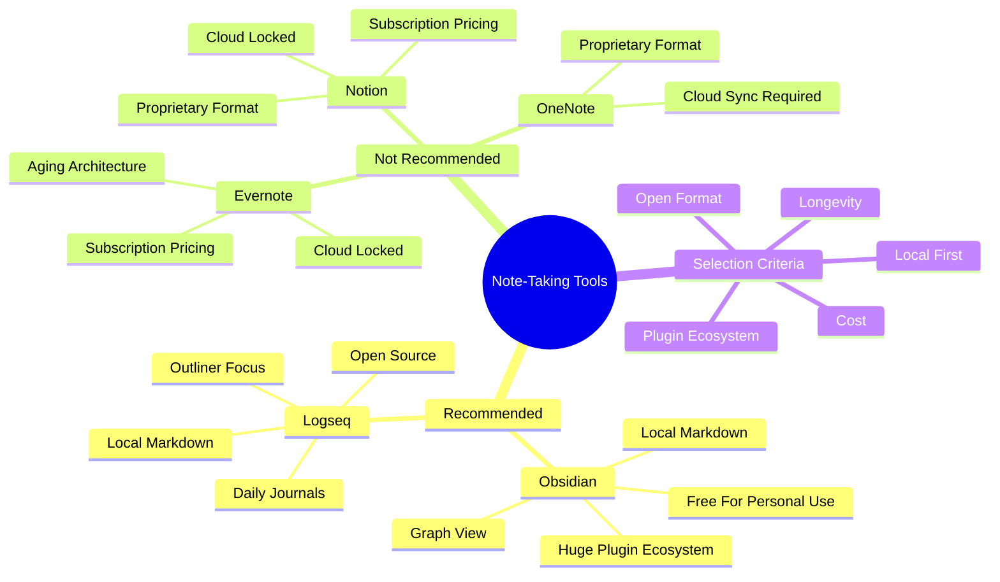

# 8.3 Note-Taking Apps

Your notes should outlive the company that hosts them. This single principle eliminates most note-taking apps on the market. This note reviews the recommended tools — Obsidian and Logseq — and explains why local-first markdown beats cloud-locked alternatives.

## The Core Principle

Note-taking tools fall into two categories:

1. **Local-first markdown:** Your notes are plain text files in a local folder. You own them. The tool is a viewer/editor, not a storage layer.
2. **Cloud-locked:** Your notes are stored in the company's proprietary format on their servers. You access them via the company's apps. If the company dies, your notes may die with it.

For learning notes — which you will reference for years or decades — local-first markdown is the only sensible choice.

## Tool 1: Obsidian

### What It Is

Obsidian is a local-first markdown note-taking tool, developed by Erica Xu and Shida Li in 2020. Free for personal use. Sync and Publish services are paid ($4-8/month each).

### Strengths

- **Local markdown files:** Notes are plain `.md` files in a local folder. Maximum portability and longevity.
- **Bidirectional linking:** `[[wiki links]]` create connections between notes. The graph view visualizes your knowledge network.
- **Plugin ecosystem:** 1000+ community plugins (kanban, dataview, spaced repetition, Excalidraw, mind maps, etc.).
- **Fast:** The app is built in Electron but heavily optimized. Search across 10,000 notes is instant.
- **Cross-platform:** Windows, Mac, Linux, iOS, Android. Sync via Obsidian Sync (paid) or any cloud service (Dropbox, Google Drive, iCloud, Syncthing).
- **No vendor lock-in:** Your notes work with any markdown tool. If Obsidian dies tomorrow, your notes survive.

### Weaknesses

- **Not open-source:** The core app is proprietary (though plugins are open).
- **No built-in outliner:** Logseq is better for outliner-style notes. (Obsidian can be configured to behave like an outliner via plugins.)
- **No built-in SRS:** Use the Spaced Repetition plugin or integrate with Anki.

### Best For

- Learners who want maximum control and longevity.
- Learners who use a separate SRS (Anki).
- Learners who want bidirectional linking and a graph view.
- Learners who want a knowledge base that scales to 10,000+ notes.

### Vault Design Principles

When designing an Obsidian vault:

1. **Use folders for organization, links for connection.** Folders are the table of contents; links are the cross-references.
2. **Use MOC (Map of Content) notes** as navigation hubs. See this vault's [[0. Home]] and chapter MOCs.
3. **Use atomic notes.** One concept per note. Easier to link, easier to review, easier to update.
4. **Use YAML frontmatter** for metadata (tags, type, chapter).
5. **Number your files** for ordered reading: `1.2 The Science of Memory.md`.

## Tool 2: Logseq

### What It Is

Logseq is a local-first markdown outliner, open-source (AGPL), developed in 2020. Free, with paid cloud sync.

### Strengths

- **Open-source:** Fully open. Community contributions welcome.
- **Outliner focus:** Each bullet is a node. Hierarchy is built-in. Excellent for hierarchical note-taking.
- **Bidirectional linking:** Same as Obsidian, with `[[wiki links]]`.
- **Daily journals:** The default workflow is a daily journal page, where you log what you learn. Backlinks accumulate automatically.
- **Local markdown:** Notes are plain `.md` files.
- **Block-level references:** You can reference and embed individual bullets, not just pages.

### Weaknesses

- **Smaller plugin ecosystem:** Fewer plugins than Obsidian.
- **Outliner paradigm:** If you don't like outliner-style notes (bullets within bullets), Logseq is not for you.
- **Slower for large graphs:** Performance degrades with very large graphs (10,000+ pages), though it is improving.

### Best For

- Learners who prefer outliner-style notes.
- Learners who want a daily journal workflow.
- Learners who want open-source.
- Learners who want block-level references.

## Tools to Avoid

### Notion

**Why avoid:** Cloud-locked. Notes are stored in Notion's proprietary format on their servers. If Notion changes their pricing, shuts down, or bans your account, your notes are inaccessible. The free tier is generous, but the format lock-in is a long-term risk.

Notion is also slow for large workspaces, has limited offline support, and the AI features (which are heavily promoted) raise privacy concerns.

**Use instead:** Obsidian or Logseq. Both can replicate Notion's databases, kanbans, and rich pages via plugins.

### Evernote

**Why avoid:** Cloud-locked. Aging architecture. Subscription pricing that has increased dramatically over the years. The free tier is now nearly unusable (2-device limit, 60MB/month upload). The company has been acquired multiple times and the future is uncertain.

**Use instead:** Obsidian or Logseq. Both can import Evernote exports.

### OneNote

**Why avoid:** Proprietary format. Sync requires a Microsoft account. The format is not easily exportable to other tools. The free tier is generous but the lock-in is severe.

**Use instead:** Obsidian or Logseq. Both support markdown, which is more portable than OneNote's format.

### Roam Research

**Why avoid:** Cloud-only (no local storage). Expensive ($15/month for personal use). The company has had reliability issues. The format is open (markdown), but the lack of local storage is a problem.

**Use instead:** Logseq, which has a very similar paradigm (outliner + bidirectional links + daily journals) but is local-first and free.

## Tool Selection Guide

| Criterion | Obsidian | Logseq |
|-----------|----------|--------|
| Price | Free (sync paid) | Free (sync paid) |
| Format | Local markdown | Local markdown |
| Open source | No (plugins yes) | Yes |
| Plugin ecosystem | Huge | Growing |
| Outliner focus | No (configurable) | Yes |
| Daily journal workflow | Optional | Default |
| Graph view | Yes | Yes |
| Block references | No (page-level only) | Yes |
| Mobile | Native | Native |

### Recommended Choice

For most learners: **Obsidian.** The plugin ecosystem and flexibility are unmatched. The vault you are reading right now is designed for Obsidian.

For learners who want outliner-style notes: **Logseq.** The daily journal workflow is excellent for learning.

For learners who want both: use them together. Many learners use Logseq for daily journals and Obsidian for the structured knowledge base.

## Workflow Integration

A complete learning workflow:

1. **Daily journal (Logseq or Obsidian Daily Notes):** Log what you study, what you learn, what you struggle with.
2. **Atomic notes (Obsidian or Logseq):** Create one note per concept, with full explanation, examples, and cross-references.
3. **MOC notes:** Create chapter or topic MOCs that link to atomic notes.
4. **Flashcards (Anki or REMNote):** Create atomic cards for discrete facts. (Obsidian and Logseq both have SRS plugins if you want integration.)
5. **Code practice (LeetCode, Exercism):** Apply CS concepts through coding problems.

The tools should serve the workflow, not the other way around. Don't optimize tools before you have a workflow.

## Common Pitfalls

### Pitfall 1: Tool Obsession

Spending more time configuring the tool than using it. Plugins, themes, custom CSS — these are procrastination. Pick a tool, set it up minimally, and start writing notes.

### Pitfall 2: Cloud-Lock-In

Choosing a cloud-locked tool because it has a slick UI. The slickness is irrelevant if your notes are inaccessible in 5 years.

### Pitfall 3: No Backup

Even local-first tools can lose data if your disk fails. Back up your vault:
- Version control (git) — best for markdown notes.
- Cloud sync (Dropbox, Google Drive, iCloud) — easy automatic backup.
- Local backup (Time Machine, rsync) — fast recovery.

Use at least two of these.

### Pitfall 4: No Structure

Dumping notes into a single folder without organization. After 100 notes, you cannot find anything. Use folders and MOCs from the start.

### Pitfall 5: Not Linking

Writing notes without `[[wiki links]]`. The value of a knowledge base is the connections, not the individual notes. Link liberally.

## Cross-References

- The Obsidian vault structure you are reading right now is the example.
- Spaced repetition tools are reviewed in [[8.2 Spaced Repetition Software]].
- Focus tools are reviewed in [[8.4 Focus and Distraction-Blocking Tools]].
- The daily workflow is in [[6.6 Review and Reinforcement System]].

#tool #note-taking #obsidian #logseq #software
