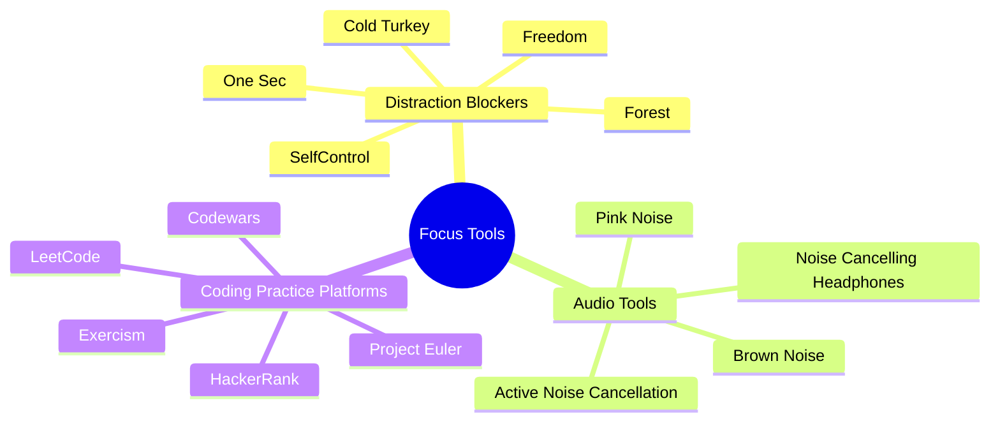

# 8.4 Focus and Distraction-Blocking Tools

Focus is environmental. Willpower is insufficient; the environment must be designed so that focus is the default and distraction requires effort. This note reviews the software tools that enforce focus, the audio tools that support it, and the coding practice platforms where CS techniques are applied.

## The Core Principle

Focus tools serve two purposes:

1. **Block distractions** — prevent access to websites, apps, and notifications during focus blocks.
2. **Manage auditory environment** — eliminate background noise and provide a consistent, non-distracting soundscape.

For CS learners, coding practice platforms are also reviewed here — they are the "application" ground for the techniques in [[5.1 MOC - CS Education]].

## Distraction-Blocking Software

### Tool 1: Freedom

**What it does:** Blocks websites and apps across all your devices (computer, phone, tablet) for a scheduled period.

**Strengths:**
- Cross-device blocking (the only tool that reliably syncs blocks across devices).
- Scheduled sessions (set up recurring focus blocks in advance).
- Locked Mode (prevents bypassing the block during the session).

**Pricing:** $8.99/month, $3.33/month annual, $199 one-time lifetime.

**Best for:** Learners with serious distraction problems who need cross-device blocking.

### Tool 2: Cold Turkey Blocker

**What it does:** Blocks websites and apps on your computer. Harder to bypass than most blockers.

**Strengths:**
- Extremely hard to bypass (cannot be uninstalled, force-killed, or circumvented during a block).
- Wildcard blocking (block entire domains, or specific URL patterns).
- Pomodoro timer integration.

**Pricing:** Free tier with limited features; $39 one-time Pro.

**Best for:** Learners who need strict enforcement and tend to bypass weaker blockers.

### Tool 3: Forest

**What it does:** Gamified focus timer. You plant a virtual tree when you start a focus session. If you leave the app, the tree dies. Surviving trees grow into a forest over time.

**Strengths:**
- Gamification makes focus feel rewarding.
- Visual representation of accumulated focus time.
- Mobile + browser extension.

**Pricing:** $3.99 one-time (mobile), free browser extension with $2 Pro upgrade.

**Best for:** Learners who respond well to gamification and want a light-touch blocker.

### Tool 4: SelfControl

**What it does:** Free Mac-only website blocker. Once started, the block cannot be bypassed — even by uninstalling the app or restarting the computer — until the timer expires.

**Strengths:**
- Free and open-source.
- Unbypassable (the strictest blocker available).
- Simple and reliable.

**Weaknesses:**
- Mac only.
- No app blocking (websites only).
- Dated UI.

**Best for:** Mac users who want a free, strict website blocker.

### Tool 5: One Sec

**What it does:** Forces a delay (typically 10-30 seconds) before opening distracting apps on your phone. The delay breaks the automatic reach for the phone.

**Strengths:**
- Reduces phone use without forbidding it (less psychological resistance).
- Works at the app level (Instagram, TikTok, Twitter).
- Cross-platform (iOS, Android, Mac).

**Pricing:** Free tier; $9 one-time Pro.

**Best for:** Learners whose primary distraction is automatic phone checking.

### Recommendation

- **Strictest:** Cold Turkey (desktop) or SelfControl (Mac).
- **Cross-device:** Freedom.
- **Gamified:** Forest.
- **Phone habit-breaking:** One Sec.

Most learners do not need all of these. Pick one desktop blocker and one phone tool. Configure them once. Use them consistently.

## Audio Tools

### Tool 1: Noise-Cancelling Headphones

**What they do:** Use active noise cancellation (ANC) to reduce low-frequency background noise (HVAC, traffic, airplane engines).

**Best models (as of 2025):**
- Sony WH-1000XM5 — best ANC, comfortable, $400.
- Bose QuietComfort Ultra — best ANC for high frequencies, $430.
- Apple AirPods Pro 2 — best in-ear ANC, $250.
- Sony WF-1000XM5 — best in-ear alternative, $280.

**When to use:**
- Noisy environments (cafes, open offices, planes).
- When you need to block speech (ANC is less effective on speech, but combined with pink noise, it works).

**Limitations:** ANC is less effective on speech and high-frequency noise. For speech blocking, combine with pink/brown noise.

### Tool 2: Pink Noise

**What it is:** A constant background sound with equal energy per octave. Softer and more natural than white noise.

**Why use it:** Masks intermittent background noise (speech, footsteps) without capturing attention. Supports focus.

**How to use:**
- Search "pink noise 10 hours" on YouTube.
- Or use myNoise.net (free web app).
- Or use Noisli (web + app, free tier).
- Or use Brain.fm (paid, $7/month, includes focus-optimized soundscapes).

### Tool 3: Brown Noise

**What it is:** A constant background sound with more energy at lower frequencies. Deeper than pink noise. Currently popular for ADHD focus.

**Why use it:** Same as pink noise, but the deeper frequency is preferred by some learners. Anecdotally better for ADHD.

**How to use:** Same as pink noise. Search "brown noise 10 hours" on YouTube.

### Tool 4: Active Noise Cancellation with Music

For learners who prefer music:
- Use noise-cancelling headphones.
- Choose instrumental music (no lyrics).
- Choose familiar music (low novelty).
- Choose music without sudden dynamic changes.

Good options: film scores (Hans Zimmer, Max Richter), instrumental hip-hop (Lo-Fi), ambient (Brian Eno, Stars of the Lid), classical (Baroque, Minimalism).

**Avoid:** music with lyrics (captures language processing), new music (captures attention), music with strong emotional associations.

## Coding Practice Platforms

For CS learners, coding practice platforms are where the techniques in [[5.1 MOC - CS Education]] are applied. Different platforms serve different purposes:

### Platform 1: LeetCode

**What it is:** The dominant platform for coding interview practice. 2000+ problems, sorted by difficulty and topic. Discussion forums with solutions.

**Strengths:**
- Largest problem set.
- Best discussion and editorial solutions.
- Most realistic for technical interviews (FAANG and big tech use LeetCode-style problems).
- Company-tagged problems (filter by company).

**Weaknesses:**
- Premium subscription ($35/month or $159/year) needed for some problems and features.
- Problem quality varies (some are poorly worded).
- Solution quality varies in the discussions.

**Best for:** Interview preparation, algorithm practice.

### Platform 2: Exercism

**What it is:** Free, open-source platform for learning 60+ programming languages. Mentor-based code review.

**Strengths:**
- Completely free (no premium tier).
- Mentor code reviews (free, volunteer-run).
- Concept-based learning paths (not just problems).
- Excellent for learning a new language.

**Weaknesses:**
- Smaller problem set than LeetCode.
- Mentor response times vary (can be days).
- Less focus on interview-style problems.

**Best for:** Learning a new language, getting code review, building fundamentals.

### Platform 3: Codewars

**What it is:** Gamified coding practice. Problems ("kata") ranked by difficulty (8 kyu to 1 kyu). Solutions are community-submitted and ranked.

**Strengths:**
- Gamified (ranks, honor).
- Community solutions (you see how others solved the same problem).
- Wide range of difficulties (beginner to expert).
- Supports many languages.

**Weaknesses:**
- Problem quality varies.
- Some problems are more "tricky" than educational.
- Less structured learning paths.

**Best for:** Casual practice, learning from others' solutions, building fluency in a language.

### Platform 4: Project Euler

**What it is:** Free problem set focused on mathematical / algorithmic problems. 800+ problems, increasing in difficulty.

**Strengths:**
- Free.
- Mathematically rich (each problem teaches a mathematical concept).
- Solutions are private (no copy-paste cheating).
- Excellent for algorithmic thinking.

**Weaknesses:**
- Purely mathematical (less representative of real-world programming).
- Difficulty ramps up steeply (early problems are easy, later problems are research-level).
- No language-specific feedback.

**Best for:** Mathematical / algorithmic deep practice.

### Platform 5: HackerRank

**What it is:** Coding practice platform with skill tracks, certifications, and interview preparation kits.

**Strengths:**
- Structured skill tracks (algorithms, data structures, SQL, etc.).
- Certifications (some employers accept HackerRank certs).
- Interview preparation kits (company-specific).

**Weaknesses:**
- Problem quality varies.
- Test cases sometimes incorrect.
- Less active community than LeetCode.

**Best for:** Structured learning paths, certifications.

### Platform Recommendation

- **For interview prep:** LeetCode (with premium if you can afford it).
- **For learning a new language:** Exercism.
- **For casual practice:** Codewars.
- **For mathematical depth:** Project Euler.
- **For structured learning paths:** HackerRank.

For most CS learners, LeetCode is the primary platform, supplemented by Exercism when learning a new language.

## Workflow Integration

A complete focus workflow:

1. **Before study session:**
   - Phone in another room (or airplane mode).
   - Activate distraction blocker (Freedom, Cold Turkey, or Forest).
   - Put on noise-cancelling headphones.
   - Start pink/brown noise or instrumental music.

2. **During study session:**
   - Single-task. No tab switching.
   - If you remember something to do, write it on a notepad (do not act on it).
   - Use Pomodoro timer (25 or 50 minutes).

3. **Between sessions:**
   - Take a low-stimulation break (no phone).
   - Walk, stretch, do housework.

4. **For CS practice:**
   - Choose a coding platform appropriate to your goal.
   - Apply the techniques from [[5.1 MOC - CS Education]].
   - Predict before running. Trace before debugging.

## Common Pitfalls

### Pitfall 1: Tool Overload

Installing every focus tool and never using any of them consistently. Pick one desktop blocker, one phone tool, one audio source. Use them every day.

### Pitfall 2: Configuring Blockers Mid-Session

Configuring the blocker during a focus session is itself a distraction. Configure blockers the night before. Activate them with one click when starting the session.

### Pitfall 3: Bypassing Blockers

The whole point of a blocker is to make distraction hard. If you bypass it (because "I just need to check one thing"), the blocker is useless. Configure blockers to be hard to bypass (Locked Mode in Freedom, Frozen Turkey in Cold Turkey).

### Pitfall 4: Treating Music as Neutral

Music with lyrics captures language processing. New music captures attention. Choose instrumental, familiar music — or use pink/brown noise instead.

### Pitfall 5: Not Using Coding Practice Platforms

Reading about algorithms without practicing them is the most common CS learning failure. Apply techniques through LeetCode, Exercism, or similar platforms. See [[5.6 Retrieval Practice for Algorithmic Thinking]].

## Cross-References

- The distraction problem is in [[4.2 The Cost of Overstimulation]].
- Workspace design is in [[4.3 Designing a Distraction-Free Workspace]].
- The Pomodoro Technique is in [[2.6 The Pomodoro Technique]].
- CS education techniques are in [[5.1 MOC - CS Education]].
- Daily focus integration is in [[6.3 Active Learning Sessions]].

#tool #focus #distraction-blocking #software #coding-practice
