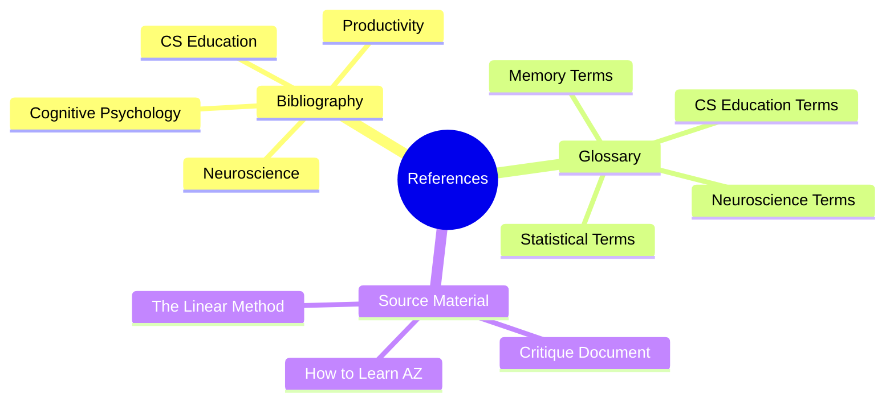

# 9.1 MOC - References

This chapter collects all citations, glossary entries, and source attributions for the vault. Use it to verify claims, dig deeper into primary literature, or settle terminology disputes.

## Mermaid Mind Map - Chapter 9

## Notes in This Chapter

- [[9.2 Bibliography]] — Key papers and books cited throughout the vault.
- [[9.3 Glossary]] — Definitions of technical terms used in the vault.

## Citation Conventions in This Vault

- Where possible, notes cite primary peer-reviewed research (e.g., Roediger & Karpicke, 2006).
- Where the source is a book, video, or secondary source, the citation includes the author and year.
- All citations are gathered in [[9.2 Bibliography]] with full reference details.

## Cross-References

- Every claim in the vault can be traced back to a reference listed in [[9.2 Bibliography]].
- Terms used in notes are defined in [[9.3 Glossary]].

#moc #reference #bibliography #glossary
